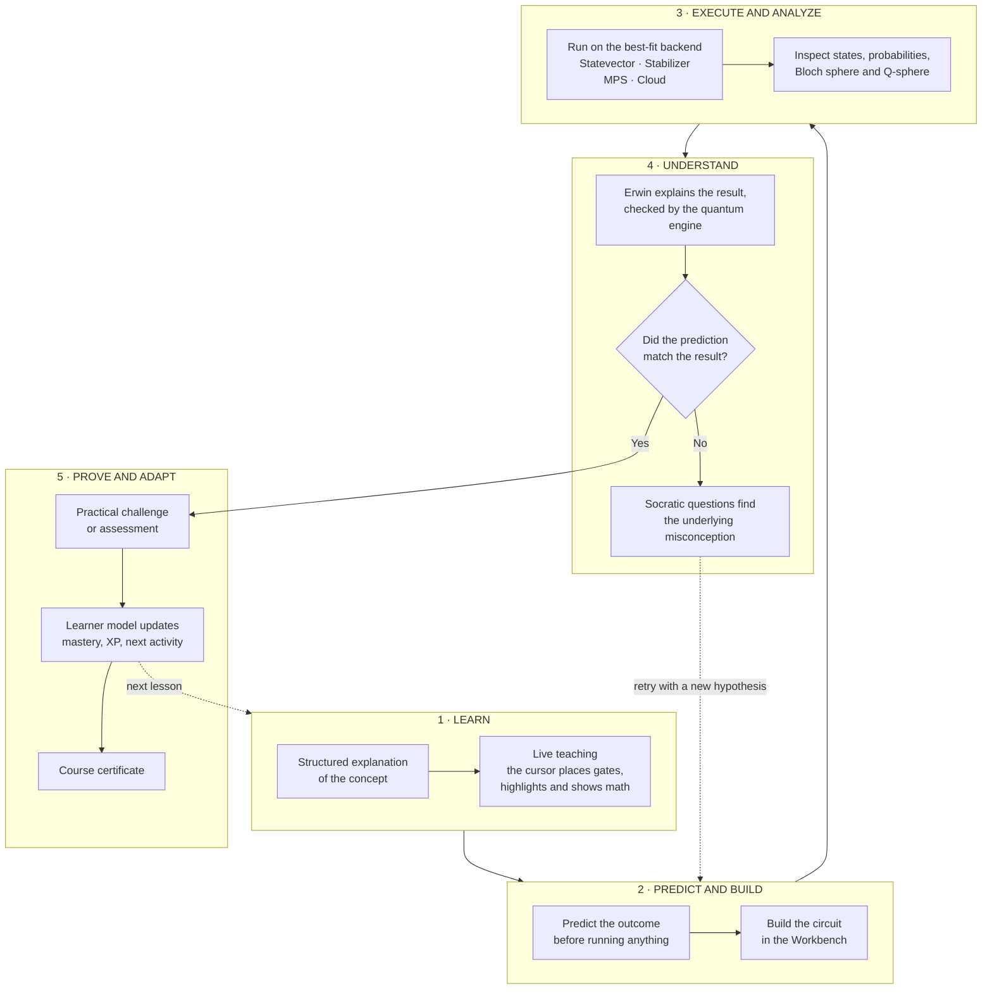
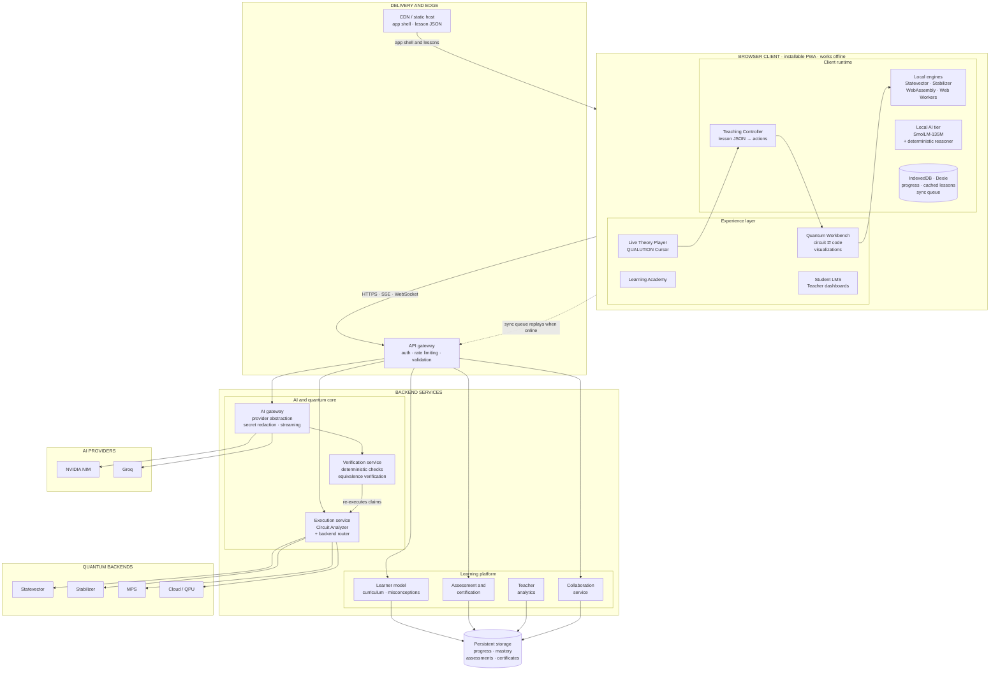
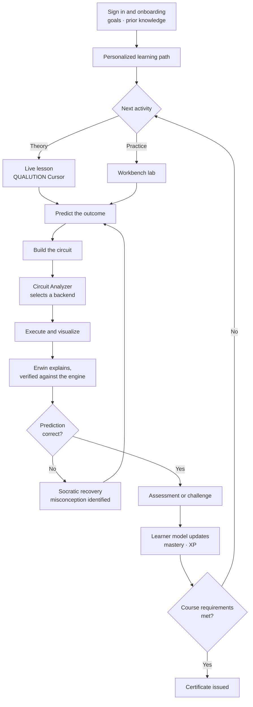
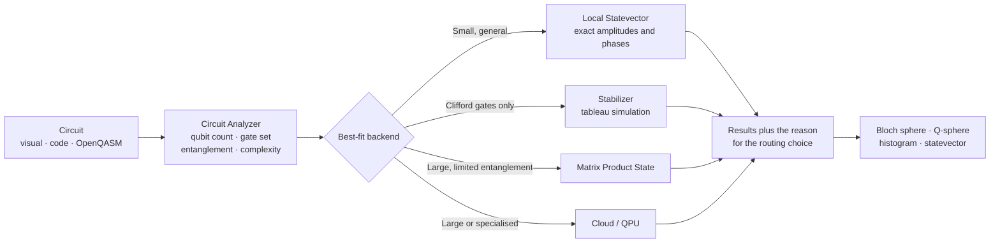
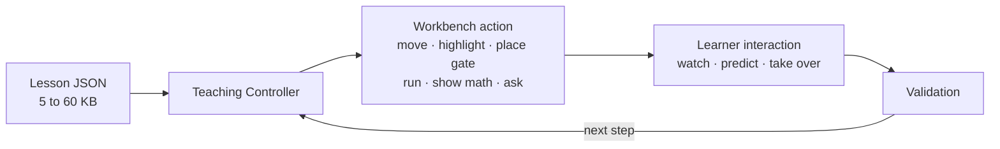
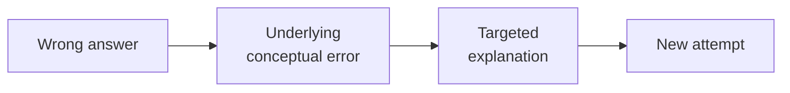
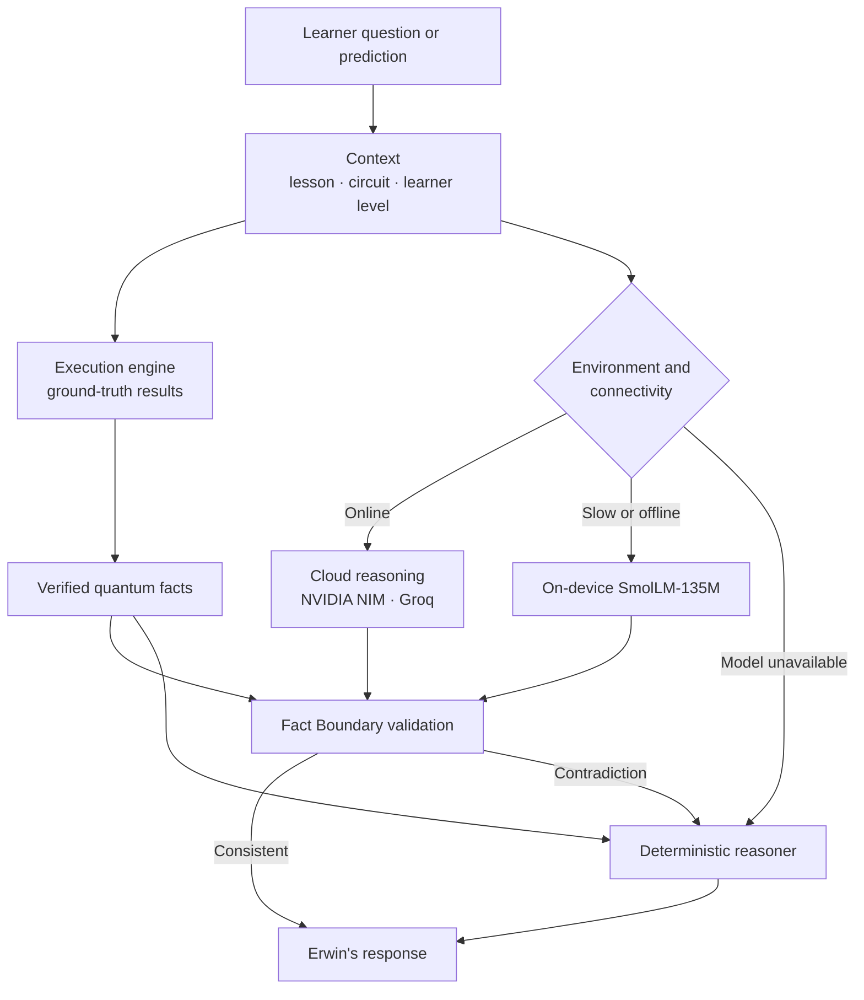

<div align="center">

# ⚛️ QUALUTION

### Live-taught quantum learning, built on a real quantum workbench

*Learn the concept. Build the circuit. Predict the result. Execute the computation. Analyze the evidence. Prove mastery.*

**The AI explains. The quantum engine verifies.**

</div>

---

## SIH Problem Statement

| | |
|---|---|
| **Problem Statement ID** | 26140 |
| **Title** | AI-Based Interactive Quantum Algorithm Learning Platform |
| **Theme** | Smart Education |
| **Category** | Software |
| **Team Name** | DADBODS |
| **Team ID** | 126917 |

## Table of Contents

- [Overview](#overview)
- [The Problem](#the-problem)
- [Our Solution](#our-solution)
- [The QUALUTION Learning Loop](#the-qualution-learning-loop)
- [Key Features](#key-features)
- [How We Are Different](#how-we-are-different)
- [Architecture](#architecture)
- [Adaptive Circuit Execution](#adaptive-circuit-execution)
- [Benchmarks](#benchmarks)
- [JSON-Driven Live Teaching](#json-driven-live-teaching)
- [Erwin: Socratic AI Companion](#erwin-socratic-ai-companion)
- [Curriculum](#curriculum)
- [Impact](#impact)
- [Feasibility and Risk Mitigation](#feasibility-and-risk-mitigation)
- [Project Status and Roadmap](#project-status-and-roadmap)
- [Getting Started](#getting-started)
- [Tech Stack](#tech-stack)
- [Team](#team)
- [Links](#links)
- [References](#references)
- [License](#license)

---

## Overview

Quantum computing is becoming an important computational paradigm, but it is hard to learn. Students face abstract mathematics, unfamiliar computational ideas, circuit-based reasoning, and specialised software, usually spread across separate lecture notes, simulators, and coding tools.

QUALUTION unifies all of it. It combines structured lessons, live teaching, a professional Quantum Workbench, multi-backend simulation, an AI tutor, assessments, a student and teacher LMS, and certification into one continuous environment.


<!-- Add a screenshot or GIF: workbench with circuit, Q-sphere and Erwin visible. -->

## The Problem

| # | Challenge | What it looks like today |
|:-:|---|---|
| 1 | High-complexity concepts | Superposition, entanglement and interference are hard to grasp without seeing circuit behaviour. |
| 2 | Theory and practice are separated | Notes in one place, a simulator in another. Concept → circuit → execution → understanding is broken across tools. |
| 3 | Static learning | Videos and PDFs offer no continuous interaction, experimentation, or feedback. |
| 4 | Limited hardware access | Real QPUs are scarce, and local simulation gets exponentially expensive as qubits grow. |
| 5 | Shallow feedback | Automated grading says "wrong", but not which misconception caused it. |
| 6 | Fragmented management | Students lack learning paths and proof of mastery, and teachers lack visibility into progress. |

## Our Solution

QUALUTION answers each gap directly.

- 🎓 **Interactive, visual learning** that makes quantum behaviour observable.
- 🧪 **All-in-one Quantum Workbench** where theory, coding, simulation and assessment live together.
- 🔀 **Circuit-intelligent execution** that picks the right simulation strategy for each circuit.
- 🤖 **Misconception-aware AI (Erwin)** that diagnoses the root cause of an error through Socratic guidance.
- 📊 **Evidence-driven curriculum** that uses demonstrated reasoning to choose the learner's next activity.
- 🏫 **Student LMS, teacher analytics, and certification** that close the loop from learning to proof of mastery.

## The QUALUTION Learning Loop



| Stage | What the learner does |
|---|---|
| **Learn** | Receives a structured explanation of a concept |
| **Interact** | Engages with visual teaching content instead of passive media |
| **Predict** | Commits to an expected outcome before running anything |
| **Build** | Constructs the circuit in the Workbench |
| **Execute** | Runs it on an appropriate backend |
| **Analyze** | Inspects states, probabilities and measurement results |
| **Prove** | Completes a practical challenge or assessment |

## Key Features

### 🧪 Quantum Workbench
Drag-and-drop circuit construction, gate placement and editing, a code editor, and OpenQASM-based workflows. Circuit and code stay in sync in both directions, so learners never have to choose between visual and programmatic thinking.

### 🎬 JSON-Driven Live Teaching (QUALUTION Cursor)
Lessons are lightweight structured data that drive the real Workbench. A teacher cursor places gates, highlights components, runs circuits and asks prediction questions. The learner can take over at any moment.

### 🧠 Intelligent Circuit Analyzer
Inspects qubit count, gate composition, entanglement and complexity, then routes the circuit to the best backend automatically.

### 🤖 Erwin, the AI Learning Companion
Detects misconceptions and guides with Socratic questions instead of handing over answers.

### ✅ Verifiable AI
AI predictions are executed and compared against simulator results, so unsupported quantum claims are caught.

### 📈 Visualisation
Circuit diagrams, probability distributions, Bloch sphere and Q-sphere views.

### 🎮 Gamified Learning Path
Structured modules, practical challenges, XP and mastery progression.

### 🏫 Student LMS and Teacher Visualisation
Track lessons, challenges, scores and prediction performance. Teachers see progress and where learners struggle.

### 🤝 Collaborative Learning
Shared circuit challenges and a shared learning workflow.

### 🏅 Assessment and Certification
Practical grading of circuit construction, gate usage, measurement probabilities, required or forbidden operations, target outcomes and state fidelity, leading to certification.

### 📴 Local-First and Low-Bandwidth
Lessons ship as 5 KB to 60 KB JSON. Browser execution, WebAssembly, Web Workers, IndexedDB (Dexie.js) and PWA capabilities keep selected workloads running offline. The principle is **local when possible, cloud when necessary**.

## How We Are Different

Teaching happens **inside** the Workbench. Structured lessons directly control live teaching, visualisation and experimentation in the same production environment.

| Capability | Conventional fragmented workflow | QUALUTION |
|---|---|---|
| Theory | Separate learning resources | Integrated interactive lessons |
| Practical work | Separate simulator and coding tools | Unified Quantum Workbench |
| Teaching | Passive videos and documents | Structured live teaching inside the Workbench |
| Visualisation | Separate tools | Integrated Bloch and Q-sphere views |
| AI assistance | Generic chatbot | Erwin with Socratic, misconception-aware guidance |
| Execution | Single or limited backend | Capability-based multi-backend routing |
| Assessment | Separate quizzes testing recall | Practical circuit challenges |
| Student management | Separate LMS | Integrated Student LMS |
| Teacher monitoring | Limited | Teacher visualisation and analytics |
| Certification | Separate process | Connected mastery pathway |

## Architecture

**Design principle:** education, AI, circuit analysis, and quantum execution are separate layers that communicate through defined interfaces. Each can evolve independently.



### User flow



## Adaptive Circuit Execution

A dense statevector needs memory that grows exponentially with qubit count, so no single simulator suits every circuit. QUALUTION treats simulation as a **backend selection problem** and routes by circuit characteristics.



| Backend | Best for | Why |
|---|---|---|
| Local Statevector (on-device / browser) | Small, general, low-complexity circuits | Full state detail, no network needed |
| Stabilizer (Gottesman–Knill) | Clifford / stabilizer circuits | Polynomial scaling for this circuit class |
| MPS (Matrix Product State) | Larger circuits with limited entanglement | Far less memory than a dense statevector |
| Cloud / QPU | Large or specialised workloads | Access beyond local limits, including real hardware |

The analyzer weighs qubit count, gate type, entanglement, and complexity, then **explains its choice to the learner**. Understanding both the algorithm and the resources needed to run it is a professional skill worth teaching.

## Benchmarks

QUALUTION routes each circuit to the engine that suits it. These benchmarks show why: a dense statevector cannot leave the low 30s of qubits on ordinary hardware, while the Stabilizer and MPS engines keep going into the hundreds and thousands of qubits.


### Highlights

| Result | Number |
|---|---|
| Largest MPS circuit simulated | **2,000 qubits**, 1,000 shots in **574.72 ms**, under **10 MB** |
| MPS accuracy on this benchmark | Truncation error **0.000000**, fidelity **1.000000** at every size |
| Largest Stabilizer circuit simulated | **1,000 qubits**, tableau memory **3.82 MB** |
| Dense statevector, for comparison | 30 qubits needs **16 GiB**; 50 qubits needs **16 PiB** (2ⁿ × 16 bytes) |

### Test setup

| Item | Value |
|---|---|
| Hardware | `[CPU model, cores, RAM]` |
| OS and runtime | `[OS, Node / Python version]` |
| Engine and library versions | `[versions]` |
| MPS circuit family | Nearest-neighbor bounded entanglement |
| Stabilizer circuit family | `[e.g. random Clifford circuit, depth D]` |
| MPS shots | 1,000 |
| MPS bond dimension limit (χ) | `[χ]` |
| Runs and statistic | `[e.g. median of 10 runs after 1 warm-up]` |
| Reproduce | `[command, e.g. python benchmarks/run_mps.py]` |

### MPS engine: 1,000 shots, nearest-neighbor bounded entanglement

| Qubits | Time | Truncation error | Fidelity | Memory |
|---:|---:|---:|---:|---|
| 25 | 16.73 ms | 0.000000 | 1.000000 | < 1 MB |
| 30 | 29.85 ms | 0.000000 | 1.000000 | < 1 MB |
| 50 | 26.13 ms | 0.000000 | 1.000000 | < 1 MB |
| 100 | 39.87 ms | 0.000000 | 1.000000 | < 1 MB |
| 200 | 89.11 ms | 0.000000 | 1.000000 | < 2 MB |
| 500 | 94.63 ms | 0.000000 | 1.000000 | < 3 MB |
| 1,000 | 219.16 ms | 0.000000 | 1.000000 | < 5 MB |
| 2,000 | 574.72 ms | 0.000000 | 1.000000 | < 10 MB |

Runtime grows roughly in proportion to qubit count (100 → 2,000 qubits is a 20× increase in size and a 14× increase in time), and memory stays in single-digit megabytes. Small differences between neighboring sizes (for example 30 vs 50 qubits) are within run-to-run timing noise.

### Stabilizer engine: tableau simulation

| Qubits | Single shot | 100 shots | Tableau memory |
|---:|---:|---:|---:|
| 10 | 0.14 ms | 2.68 ms | 441 B |
| 50 | 0.59 ms | 28.64 ms | 9.96 KB |
| 100 | 3.49 ms | 193.81 ms | 39.45 KB |
| 500 | 214.31 ms | 24.54 s | 978.52 KB |
| 1,000 | 1.91 s | 190.87 s | 3.82 MB |

Tableau memory follows (2n + 1)² bytes, so it grows quadratically and stays under 4 MB at 1,000 qubits.

### Scope and limits

- **MPS** is efficient only when entanglement stays bounded. Highly entangled circuits need a large bond dimension, and the router sends those elsewhere.
- **Stabilizer** covers Clifford circuits only. In the current implementation each shot is simulated independently, so time scales linearly with shots; reusing the final tableau for sampling is a planned optimization.
- **Statevector** is exact and used for small and general circuits. Its memory doubles with every added qubit, and the Workbench shows the requirement before running.
- Timings depend on the hardware above and should be read as relative behavior across engines, not absolute records.

## JSON-Driven Live Teaching

Instead of shipping a video, a lesson is **data** that a Teaching Controller plays inside the real Workbench.



A lesson can move the cursor to a circuit element, highlight a component, place a gate, execute a circuit, display math, ask a prediction question, wait for learner input, and validate the learner's actions.

<details>
<summary><b>Illustrative lesson snippet</b> (simplified; the real schema may differ)</summary>

```json
{
  "id": "superposition-hadamard",
  "title": "Superposition and the Hadamard gate",
  "steps": [
    { "action": "showMath", "latex": "H|0\\rangle = \\tfrac{1}{\\sqrt{2}}(|0\\rangle + |1\\rangle)" },
    { "action": "moveCursor", "target": "qubit-0" },
    { "action": "placeGate", "gate": "H", "qubit": 0, "column": 0 },
    { "action": "askPrediction",
      "question": "What will measuring qubit 0 give?",
      "options": ["Always 0", "Always 1", "50% 0 and 50% 1"],
      "answer": 2 },
    { "action": "runCircuit", "shots": 1000 },
    { "action": "waitForInput", "until": "learnerBuildsCircuit" },
    { "action": "validate", "check": "probabilities",
      "expected": { "0": 0.5, "1": 0.5 }, "tolerance": 0.05 }
  ]
}
```

</details>

| Benefit | Detail |
|---|---|
| Lightweight | 5 KB to 60 KB per lesson, so it works on low bandwidth |
| Interactive | Teaching actions manipulate the same circuit the learner uses |
| Learner takeover | Seamless switch from demonstration to hands-on |
| Reusable | New lessons need no Workbench redesign and no hard-coding |
| Practical | The lesson flows straight into building and running circuits |

## Erwin: Socratic AI Companion

Erwin doesn't just say "wrong." It works out **why**.



When a learner predicts an incorrect distribution, Erwin asks things like:

- What state did you expect?
- Which gate changed the state?
- What happens right before measurement?
- Can you modify the circuit and test your hypothesis?

### Verifiable AI pipeline

Generated explanations, code and optimisations are checked against the execution engine using deterministic checks and equivalence verification. The AI never gets to present an unverified quantum result as fact.



### Multi-signal learner model

Predictions, circuit behaviour and assessment results are combined to spot learning gaps and choose the next activity, so progress is **evidence-driven rather than time-driven**.

## Curriculum

| Track | Modules |
|---|---|
| **Foundations** | Bits and Qubits · Superposition and Hadamard · Multi-Qubit Systems and Entanglement · Measurement and Probability |
| **Circuit Design and Algorithms** | Gate Library · Circuit Design and Complexity · Deutsch–Jozsa · Grover Search |
| **Advanced and Variational** | Variational Circuits · QAOA · VQE · Adaptive Execution |

Each module ends with an assessment and a practical challenge.

**Example: learning Grover's Search.** Instead of *watch Grover, answer a quiz*, the learner goes through Understand → Predict → Build → Execute → Observe → Modify → Explain → Prove. They see amplitude amplification, predict which state gets amplified, run the circuit, tweak the oracle or diffusion operator, and rerun. Erwin steps in if the prediction was off, and a challenge closes it out.

## Impact

| Audience | Benefit |
|---|---|
| 🎓 Students | Hands-on guided learning that shortens the learning curve |
| 👩‍🏫 Educators and academics | Adaptive teaching with real experiments and less prep effort |
| 🧑‍💼 Industry professionals | Rapid, job-relevant upskilling on real or simulated backends |
| 🏛️ Institutions | One scalable environment for learning, experimentation and assessment |
| 🔭 Quantum enthusiasts | Accessible, visual, self-paced learning |

| Dimension | Outcome |
|---|---|
| Educational | Learning by visualisation and simulation; misconceptions addressed at the root |
| Economic | Lower experimentation cost; faster workforce skill development |
| Social | Quantum access beyond physical QPU facilities; broader participation |
| Environmental | Less physical-lab dependence; simulation-first before QPU use |

## Feasibility and Risk Mitigation

| Challenge | Our mitigation |
|---|---|
| **Quantum execution scalability:** exponential resource growth | **Adaptive execution:** resource-aware routing and execution limits for larger circuits |
| **AI trust and quantum correctness:** AI may produce incorrect quantum behaviour | **Quantum verification:** deterministic checks and equivalence verification of AI-generated operations |
| **Adaptive learning accuracy:** is the learner truly understanding? | **Multi-signal learner model:** predictions, circuit behaviour and assessments combined |
| **Interactive teaching at scale:** avoid hard-coding every lesson | **JSON-driven lesson engine:** reusable structured lessons with the QUALUTION Cursor |

**Feasibility:** ✅ Technical (proven methods, mature tech) · ✅ Operational (modular, browser-based) · ✅ Market (growing quantum workforce need) · ✅ Economic (lightweight JSON, reusable lessons, local execution)

## Project Status and Roadmap

All core modules are implemented:

- [x] Concept, architecture and learning model
- [x] Quantum Workbench (drag-and-drop + code, bidirectional sync)
- [x] JSON-driven lesson engine and QUALUTION Cursor
- [x] Circuit Analyzer and multi-backend routing (Statevector, Stabilizer, MPS, cloud)
- [x] Erwin AI with Socratic guidance, misconception detection and verification
- [x] Student LMS, challenges and certification
- [x] Teacher visualisation and analytics
- [x] Collaborative learning

### Future directions

- 🔌 Additional cloud quantum hardware providers, enabling a path from simulation to more real QPUs
- 🧠 Richer learner models and deeper misconception analysis
- 👥 Real-time collaborative circuit editing and instructor-led classroom sessions
- 📊 Population-level learning analytics for educators
- 🏆 Expanded competency-based certification

## Getting Started

### Prerequisites

- Node.js `[version]` and npm
- Python `[version]` for the backend services
- API keys as needed: AI provider (NVIDIA NIM, Groq) and cloud quantum provider

### Installation

```bash
# 1. Clone the repository
git clone [YOUR_REPO_URL]
cd [YOUR_REPO_NAME]

# 2. Install frontend dependencies
npm install

# 3. Install backend dependencies
pip install -r requirements.txt

# 4. Configure environment
cp .env.example .env
# then fill in the required values

# 5. Start the backend and the frontend
[backend start command]
npm run dev
```

Open the local URL printed by the dev server in your browser.

### Environment variables

| Variable | Purpose |
|---|---|
| `[VAR_NAME]` | `[what it is for]` |

Provider keys stay on the backend only and are never exposed to the browser. Never commit real keys.

## Tech Stack

| Layer | Technology |
|---|---|
| Frontend | React 19, TypeScript, Vite |
| Animation and UI motion | Anime.js |
| Local execution | WebAssembly, Web Workers |
| Offline and persistence | PWA, IndexedDB via Dexie.js |
| Quantum simulation | Statevector, Stabilizer, MPS, cloud backend, OpenQASM, Qiskit, Qiskit Aer |
| AI and learning | Erwin (Socratic tutor), misconception engine, NVIDIA NIM, Groq, on-device SmolLM-135M |
| Backend | Python, FastAPI |
| Testing | Vitest, Pytest |

## Team

**Team DADBODS**, Smart India Hackathon 2026

| Name | Role |
|---|---|
| `[Name]` | `[Role]` |

Institution: `[College]` · Mentor: `[Name]`

## Links

| | |
|---|---|
| Demo video | `[URL]` |
| Live app | `[URL]` |
| SIH presentation | `[URL]` |

## References

- IEEE research on the abstraction gap in quantum learning and the need to connect theory with executable programs. `[add link]`
- IEEE workforce-development research identifying education as key to the emerging quantum workforce. `[add link]`
- IEEE Quantum Week (QCE) papers on university, industry and research efforts to build the quantum workforce. `[add link]`

## License

`[License name]`. See [LICENSE](LICENSE).

---

<div align="center">

**Learn the concept. Build the circuit. Predict the result. Execute the computation. Analyze the evidence. Collaborate with others. Prove mastery.**

Made with ⚛️ by Team DADBODS for Smart India Hackathon 2026

</div>
