<div align="center">

# ⚛️ QUALUTION

### Learn it. Build it. Predict it. Run it. Prove it.

**An AI-based interactive quantum algorithm learning platform, with a hardware-calibrated Digital Twin that shows how real quantum chips behave.**


</div>

---

## ⚡ At a Glance

| 🧮 **2,000 qubits** | 🔬 **1,000 qubits** | 🧬 **Ideal vs Noisy** | 📦 **5 – 60 KB** |
|:---:|:---:|:---:|:---:|
| MPS circuit, 1,000 shots in **574.72 ms**, under 10 MB | Stabilizer circuit, tableau memory **3.82 MB** | Every circuit runs on a **Digital Twin** of real IBM hardware | Full interactive lesson size, built for **low bandwidth** |

| 🔀 **4 backends** | 🛰️ **2 hardware twins** | 🦀 **Rust + WASM** | 📴 **0 network calls** |
|:---:|:---:|:---:|:---:|
| Statevector, Stabilizer, MPS, Cloud/QPU, chosen automatically | `FakeManilaV2` and `FakeJakartaV2` calibration snapshots | Client-side fidelity with automatic TypeScript fallback | Digital Twin works fully offline |

### SIH Problem Statement

| | |
|---|---|
| **Problem Statement ID** | 26140 |
| **Title** | AI-Based Interactive Quantum Algorithm Learning Platform |
| **Theme** | Smart Education |
| **Category** | Software |

---

## 📑 Table of Contents

1. [Overview](#-overview)
2. [The Problem](#-the-problem)
3. [Our Solution](#-our-solution)
4. [Users and Roles](#-users-and-roles)
5. [The QUALUTION Learning Loop](#-the-qualution-learning-loop)
6. [Key Features](#-key-features)
7. [🆕 Digital Twin: Learn on a Noisy Quantum Computer](#-digital-twin-learn-on-a-noisy-quantum-computer)
8. [How We Are Different](#-how-we-are-different)
9. [Architecture](#-architecture)
10. [Adaptive Circuit Execution](#-adaptive-circuit-execution)
11. [Benchmarks](#-benchmarks)
12. [JSON-Driven Live Teaching](#-json-driven-live-teaching)
13. [Erwin: Socratic AI Companion](#-erwin-socratic-ai-companion)
14. [Assessment and Certification Flow](#-assessment-and-certification-flow)
15. [Curriculum](#-curriculum)
16. [Impact](#-impact)
17. [Feasibility and Risk Mitigation](#-feasibility-and-risk-mitigation)
18. [Project Status and Roadmap](#-project-status-and-roadmap)
19. [Getting Started](#-getting-started)
20. [Tech Stack](#-tech-stack)
21. [Team](#-team)
22. [References](#-references)
23. [License](#-license)

---

## 🌌 Overview

Quantum computing is becoming an important computational paradigm, but it is hard to learn. Students face abstract mathematics, unfamiliar computational ideas, circuit-based reasoning, and specialised software, usually spread across separate lecture notes, simulators and coding tools.

Textbooks also teach an idealised machine. Real quantum processors are **noisy**: qubits decay, phases drift, gates fail, and only some qubits are physically connected.

**QUALUTION unifies all of it.** It combines structured lessons, live teaching, a professional Quantum Workbench, multi-backend simulation, a **hardware-calibrated Digital Twin**, an AI tutor, assessments, a student and teacher LMS, and certification into one continuous environment.

> **Textbook quantum computing meets real-world quantum hardware, in one browser tab.**

---

## 🧩 The Problem

| # | Challenge | What it looks like today |
|:-:|---|---|
| 1 | **High-complexity concepts** | Superposition, entanglement and interference are hard to grasp without seeing circuit behaviour. |
| 2 | **Theory and practice are separated** | Notes in one place, a simulator in another. Concept → circuit → execution → understanding is broken across tools. |
| 3 | **Static learning** | Videos and PDFs offer no continuous interaction, experimentation or feedback. |
| 4 | **Limited hardware access** | Real QPUs are scarce, and local simulation gets exponentially expensive as qubits grow. |
| 5 | **The ideal-vs-real gap** | Learners see perfect results in simulators, then meet noise, errors and connectivity limits for the first time on real hardware. |
| 6 | **Shallow feedback** | Automated grading says "wrong", but not which misconception caused it. |
| 7 | **Fragmented management** | Students lack learning paths and proof of mastery, and teachers lack visibility into progress. |

---

## 💡 Our Solution

QUALUTION answers each gap directly.

| | Answer |
|---|---|
| 🎓 | **Interactive, visual learning** that makes quantum behaviour observable. |
| 🧪 | **All-in-one Quantum Workbench** where theory, coding, simulation and assessment live together. |
| 🔀 | **Circuit-intelligent execution** that picks the right simulation strategy for each circuit. |
| 🧬 | **Hardware-calibrated Digital Twin** that runs every circuit twice, ideal and noisy, and measures the damage. |
| 🤖 | **Misconception-aware AI (Erwin)** that diagnoses the root cause of an error through Socratic guidance, grounded in real calibration data. |
| 📊 | **Evidence-driven curriculum** that uses demonstrated reasoning to choose the learner's next activity. |
| 🏫 | **Student LMS, teacher analytics and certification** that close the loop from learning to proof of mastery. |

---

## 👥 Users and Roles

QUALUTION serves four kinds of users, each with their own view of the same platform.

| Role | What they do |
|---|---|
| 🎓 **Student** | Follows learning paths, builds circuits, predicts outcomes, earns XP and certificates |
| 👩‍🏫 **Teacher** | Assigns modules, monitors progress, sees where learners struggle |
| 🧑‍💼 **Professional** | Upskills quickly on real or simulated backends |
| 🔭 **Enthusiast** | Explores self-paced with visual, accessible lessons |

### Student journey

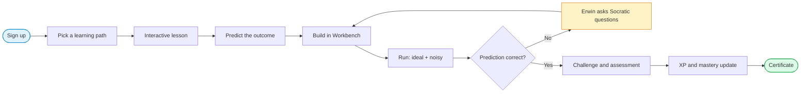

### Teacher flow

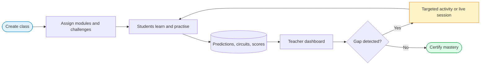

---

## 🔁 The QUALUTION Learning Loop

> **Commit to a prediction first, then let the evidence decide.**


| Stage | What the learner does |
|---|---|
| **Learn** | Receives a structured explanation of a concept |
| **Interact** | Engages with visual teaching content instead of passive media |
| **Predict** | Commits to an expected outcome before running anything |
| **Build** | Constructs the circuit in the Workbench |
| **Execute** | Runs it on an appropriate backend, ideal and on the hardware twin |
| **Analyze** | Inspects states, probabilities, measurement results and noise impact |
| **Prove** | Completes a practical challenge or assessment |

---

## ✨ Key Features

### 🧪 Quantum Workbench
Drag-and-drop circuit construction, gate placement and editing, a code editor, and OpenQASM-based workflows. Circuit and code stay in sync in both directions, so learners never have to choose between visual and programmatic thinking.

### 🧬 Digital Twin
A software replica of real IBM quantum hardware. Every run is simulated twice, once ideal and once with calibrated noise, then compared with a fidelity score. [Full details below.](#-digital-twin-learn-on-a-noisy-quantum-computer)

### 🎬 JSON-Driven Live Teaching (QUALUTION Cursor)
Lessons are lightweight structured data that drive the real Workbench. A teacher cursor places gates, highlights components, runs circuits and asks prediction questions. The learner can take over at any moment.

### 🧠 Intelligent Circuit Analyzer
Inspects qubit count, gate composition, entanglement and complexity, then routes the circuit to the best backend automatically.

### 🤖 Erwin, the AI Learning Companion
Detects misconceptions and guides with Socratic questions instead of handing over answers. Hardware explanations are read from live calibration data.

### ✅ Verifiable AI
AI predictions are executed and compared against simulator results, so unsupported quantum claims are caught.

### 📈 Visualisation
Circuit diagrams, probability distributions, Bloch sphere and Q-sphere views, plus ideal-vs-noisy distribution overlays.

### 🎮 Gamified Learning Path
Structured modules, practical challenges, XP and mastery progression.

### 🏫 Student LMS and Teacher Visualisation
Track lessons, challenges, scores and prediction performance. Teachers see progress and where learners struggle.

### 🤝 Collaborative Learning
Shared circuit challenges and a shared learning workflow.

### 🏅 Assessment and Certification
Practical grading of circuit construction, gate usage, measurement probabilities, required or forbidden operations, target outcomes and state fidelity, leading to certification.

### 📴 Local-First and Low-Bandwidth
Lessons ship as 5 KB to 60 KB JSON. Browser execution, WebAssembly, Web Workers, IndexedDB (Dexie.js) and PWA capabilities keep selected workloads running offline. The principle is **local when possible, cloud when necessary.**

---

## 🧬 Digital Twin: Learn on a Noisy Quantum Computer

The **Digital Twin** is a software replica of real physical quantum hardware, built from calibration snapshots of IBM Falcon-family processors (`FakeManilaV2` and `FakeJakartaV2`).

Its purpose is to **bridge the gap between textbook quantum computing and real-world noisy quantum processors (the NISQ era)**. Learners see what their circuit *should* do, what it *actually* does on a real chip, and exactly why the two differ.

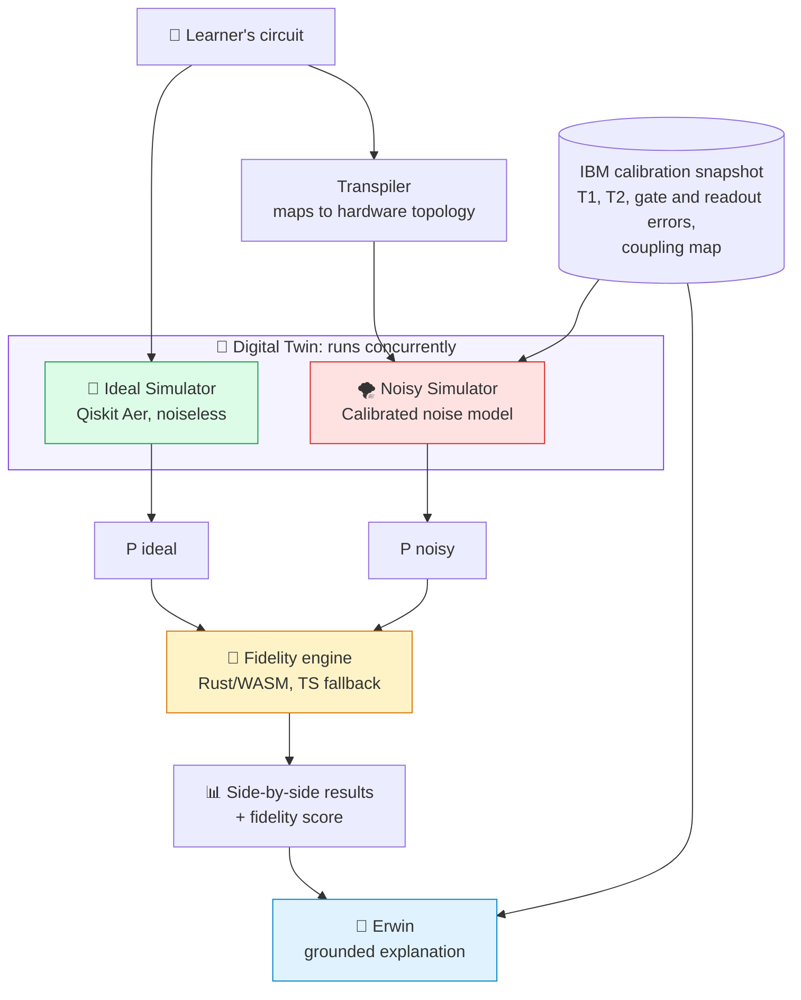

### 1. 🔀 Dual Concurrent Simulation

When a learner designs and runs a circuit, the Digital Twin runs **two simulations at the same time**:

| Simulator | What it models | Purpose |
|---|---|---|
| 🌟 **Ideal Simulator** | Pure, noiseless state evolution using Qiskit Aer | Shows what the circuit *should* produce in a perfect world |
| 🌪️ **Hardware-Calibrated Noisy Simulator** | Physical noise from real IBM Quantum calibration snapshots | Shows what the circuit *would* produce on the real chip |

**The noisy simulator is calibrated with real measured values:**

| Parameter | Physical meaning | Effect on your circuit |
|---|---|---|
| **$T_1$ relaxation time** | Energy decay from $\lvert 1\rangle$ to $\lvert 0\rangle$ | Excited states "leak" to ground state over time |
| **$T_2$ dephasing time** | Loss of quantum phase coherence | Superpositions and interference wash out |
| **Single-qubit gate error** | Measured error rates for $X$ and $\sqrt{X}$ | Small error added per gate |
| **Two-qubit gate error** | Measured error rates for $CX$ (CNOT) | Usually the dominant error source |
| **Readout error** | Chance a measurement reports the wrong bit | Corrupts the final distribution |
| **Coupling constraints** | Qubits interact only if physically connected | Forces extra SWAPs (see section 3) |

### 2. 📐 Dual-Engine Classical Fidelity

To measure how much real hardware degrades the output, the Digital Twin computes the **squared Bhattacharyya coefficient** between the two output distributions:

$$
F(P_{\text{ideal}}, P_{\text{noisy}}) = \left( \sum_{x} \sqrt{P_{\text{ideal}}(x)\cdot P_{\text{noisy}}(x)} \right)^2
$$

| Property | Detail |
|---|---|
| 🚀 **High performance** | Computed client-side in **Rust compiled to WebAssembly** (`.wasm`) |
| 🛟 **Resilient** | Automatically falls back to a **pure TypeScript** implementation if WebAssembly is unsupported |
| 📏 **Scale** | `1.0` = perfect fidelity (exact match). `0.0` = complete decoherence (orthogonal distributions) |

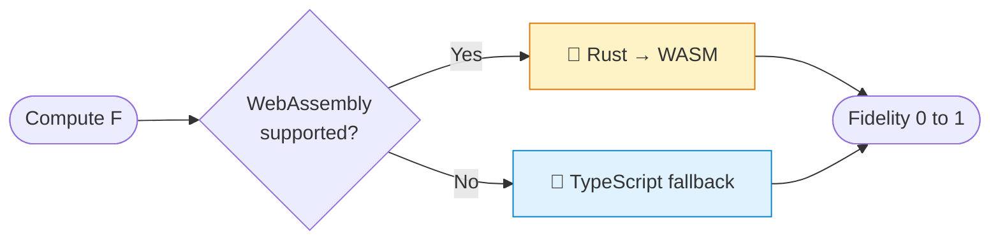

**Reading the score**

| Fidelity | Interpretation for the learner |
|:---:|---|
| **0.95 – 1.00** | Circuit survives this hardware very well |
| **0.80 – 0.95** | Noticeable degradation, worth investigating which gates cost the most |
| **below 0.80** | Heavy decoherence, consider a shallower circuit or better qubit placement |

> These bands are teaching guidelines, not hardware specifications.

### 3. 🗺️ Physical Hardware Topology and SWAP Routing

The Digital Twin **visualises the physical chip layout** so learners see real connectivity limits.

**`FakeManilaV2`: 5-qubit linear chain**

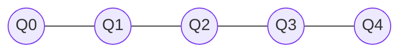

**`FakeJakartaV2`: 7-qubit H-shaped layout**

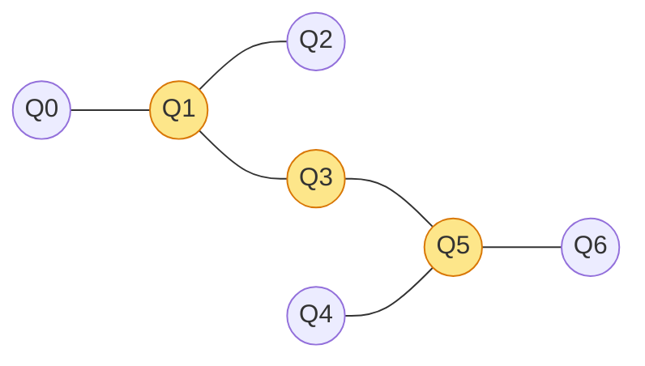

**What happens when you break connectivity?** Place a two-qubit gate between **non-adjacent** qubits, for example $CX(Q_0, Q_2)$ on the linear chain. The hardware cannot do this directly, so the compiler inserts SWAP gates. The Digital Twin shows this overhead live.

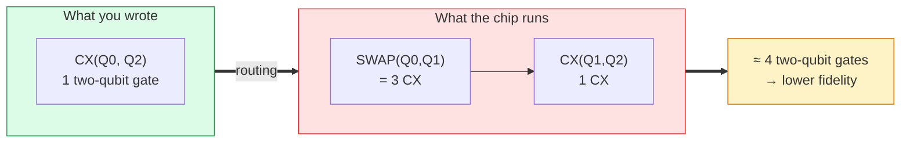

Because each extra $CX$ multiplies in its own error, the cost compounds. As an *illustrative* example, with a $0.88\%$ $CX$ error: a single gate keeps about $0.9912$ of the signal, while four gates keep about $0.9912^4 \approx 0.965$. Real results depend on the exact calibration snapshot and on the compiler's routing choice.

### 4. 🎓 Grounded AI Tutor Explanations

Instead of generic advice like "noise reduces accuracy", **Erwin reads the hardware's calibration telemetry** and pinpoints the exact physical cause.

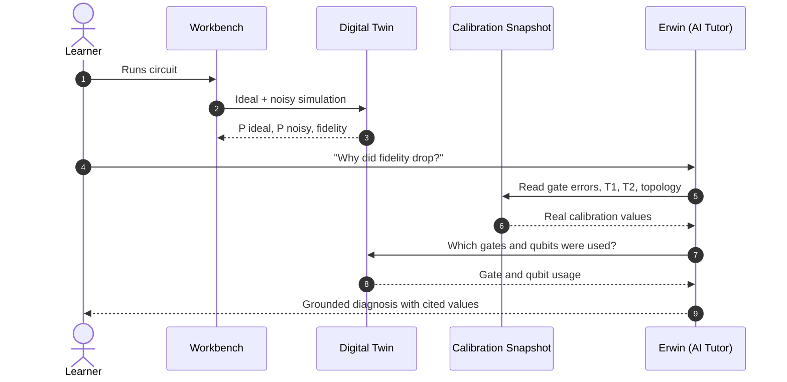

**Example diagnosis:** *"Your fidelity dropped mainly because $CX(1,2)$ has a $0.88\%$ error rate on this snapshot, and qubit $Q_2$ has a shorter $T_1$ than its neighbours, so excited-state amplitude decays before measurement."*

| Principle | How it is enforced |
|---|---|
| **Grounded in data** | Every number Erwin quotes is pulled from the bundled calibration snapshot |
| **Checkable** | Explanations reference specific gates and qubits the learner can inspect in the Workbench |
| **Socratic** | Erwin still asks guiding questions before revealing the full diagnosis |

### 5. 📴 100% Offline-First Architecture

| Guarantee | Detail |
|---|---|
| 🚫 **Zero external network calls** | Calibration snapshots are bundled directly into the backend through `qiskit_ibm_runtime.fake_provider` |
| 🛟 **Backend-offline resilience** | If the backend is ever unreachable, the frontend serves **verified offline snapshots**, so learning continues uninterrupted |
| 🔒 **Reproducible** | Fixed snapshots mean the same circuit gives the same noise model for every learner and every classroom |

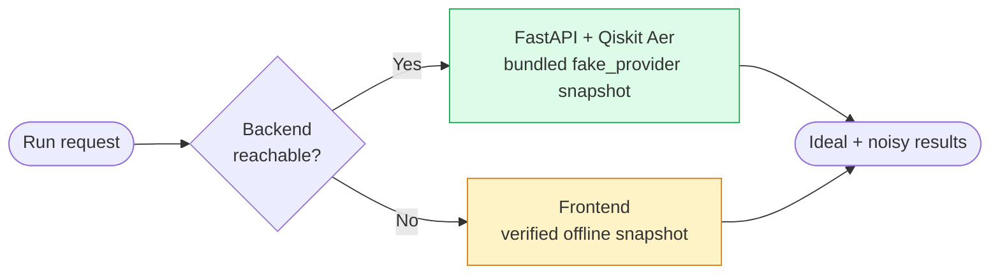

### 🎒 A Digital Twin lesson in practice

| Step | What the learner does | What they discover |
|:-:|---|---|
| 1 | Builds a **Bell state** circuit | Ideal result: only `00` and `11`, 50% each |
| 2 | Runs it on the twin | The noisy result shows small `01` and `10` counts |
| 3 | Reads the **fidelity score** | A single number quantifying the damage |
| 4 | Moves the $CX$ to non-adjacent qubits | SWAPs appear, fidelity drops further |
| 5 | Asks Erwin why | Gets a diagnosis citing real gate errors and $T_1$/$T_2$ values |
| 6 | Re-maps the circuit onto better qubits | Fidelity recovers: *noise-aware design* |

---

## 🆚 How We Are Different

> **Teaching happens inside the Workbench.** Structured lessons directly control live teaching, visualisation and experimentation in the same production environment.

| Capability | Conventional fragmented workflow | **QUALUTION** |
|---|---|---|
| Theory | Separate learning resources | Integrated interactive lessons |
| Practical work | Separate simulator and coding tools | Unified Quantum Workbench |
| Teaching | Passive videos and documents | Structured live teaching inside the Workbench |
| Visualisation | Separate tools | Integrated Bloch, Q-sphere and ideal-vs-noisy views |
| **Hardware realism** | Ideal simulators only; noise discovered later on real QPUs | **Digital Twin with calibrated IBM noise and topology** |
| AI assistance | Generic chatbot | Erwin: Socratic, misconception-aware, grounded in calibration data |
| Execution | Single or limited backend | Capability-based multi-backend routing |
| Assessment | Separate quizzes testing recall | Practical circuit challenges |
| Student management | Separate LMS | Integrated Student LMS |
| Teacher monitoring | Limited | Teacher visualisation and analytics |
| Certification | Separate process | Connected mastery pathway |
| Connectivity | Cloud-dependent | Offline-first PWA |

---

## 🏗️ Architecture

> **Design principle:** education, AI, circuit analysis, hardware twin and quantum execution are separate layers that communicate through defined interfaces. Each can evolve independently.

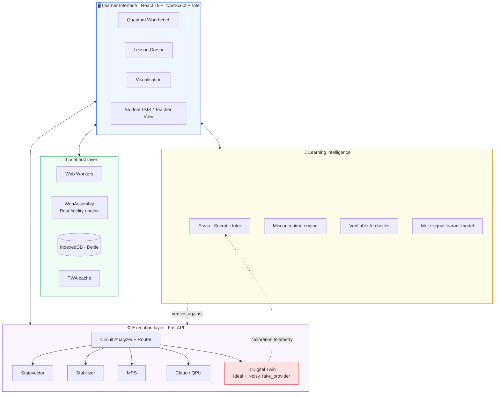

### Request flow: from circuit to insight

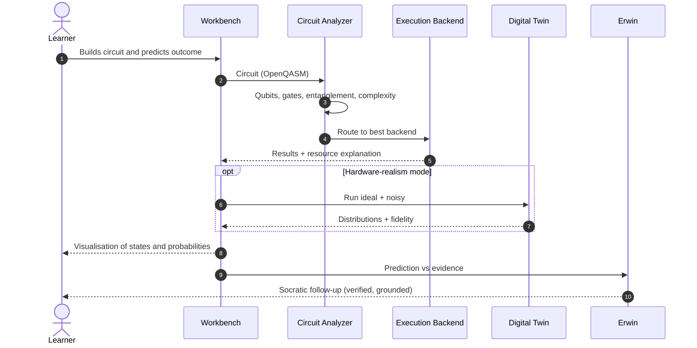

---

## 🔀 Adaptive Circuit Execution

A dense statevector needs memory that grows exponentially with qubit count, so no single simulator suits every circuit. QUALUTION treats simulation as a **backend selection problem** and routes by circuit characteristics.

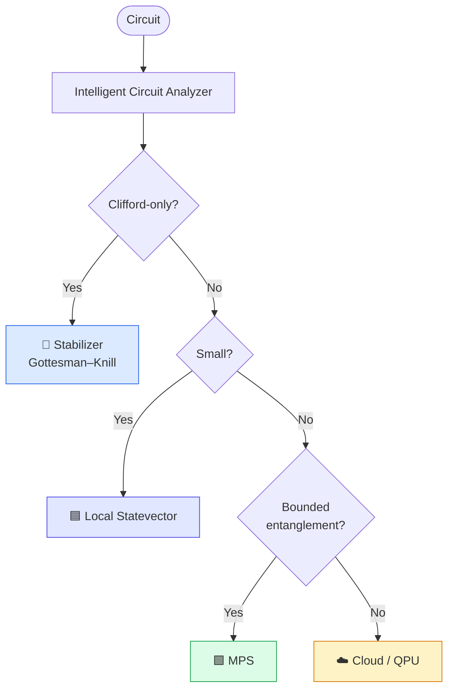

| Backend | Best for | Why |
|---|---|---|
| **Local Statevector** (on-device / browser) | Small, general, low-complexity circuits | Full state detail, no network needed |
| **Stabilizer** (Gottesman–Knill) | Clifford / stabilizer circuits | Polynomial scaling for this circuit class |
| **MPS** (Matrix Product State) | Larger circuits with limited entanglement | Far less memory than a dense statevector |
| **Cloud / QPU** | Large or specialised workloads | Access beyond local limits, including real hardware |

The analyzer weighs qubit count, gate type, entanglement and complexity, then **explains its choice to the learner**. Understanding both the algorithm and the resources needed to run it is a professional skill worth teaching.

> 🧬 The **Digital Twin** is a separate, learner-selected mode layered on Qiskit Aer. It targets the small circuits (5 to 7 qubits) that match the bundled hardware snapshots, rather than competing with the scalable backends above.

---

## 📊 Benchmarks

QUALUTION routes each circuit to the engine that suits it. These benchmarks show why: a dense statevector cannot leave the low-30s of qubits on ordinary hardware, while the Stabilizer and MPS engines keep going into the hundreds and thousands.

### Highlights

| Result | Number |
|---|---|
| Largest MPS circuit simulated | **2,000 qubits**, 1,000 shots in **574.72 ms**, under 10 MB |
| MPS accuracy on this benchmark | Truncation error `0.000000`, fidelity `1.000000` at every size |
| Largest Stabilizer circuit simulated | **1,000 qubits**, tableau memory **3.82 MB** |
| Dense statevector for comparison | 30 qubits needs **16 GiB**; 50 qubits needs **16 PiB** ($2^n \times 16$ bytes) |

### Test setup

| Item | Value |
|---|---|
| Hardware | `[CPU model, cores, RAM]` |
| OS and runtime | `[OS, Python or Node version]` |
| Library versions | `[Qiskit / Aer / your engine version]` |
| Circuit family (MPS) | Nearest-neighbor bounded entanglement |
| Circuit family (Stabilizer) | `[e.g. random Clifford circuit, depth D]` |
| Shots (MPS) | 1,000 |
| MPS bond dimension limit χ | `[χ]` |
| Runs and statistic | `[e.g. median of 10 runs after 1 warm-up]` |
| Reproduce | `[command, e.g. python benchmarks/run_mps.py]` |

### MPS engine: 1,000 shots, nearest-neighbor bounded entanglement

| Qubits | Time | Truncation error | Fidelity | Memory |
|---:|---:|:---:|:---:|:---:|
| 25 | 16.73 ms | 0.000000 | 1.000000 | < 1 MB |
| 30 | 29.85 ms | 0.000000 | 1.000000 | < 1 MB |
| 50 | 26.13 ms | 0.000000 | 1.000000 | < 1 MB |
| 100 | 39.87 ms | 0.000000 | 1.000000 | < 1 MB |
| 200 | 89.11 ms | 0.000000 | 1.000000 | < 2 MB |
| 500 | 94.63 ms | 0.000000 | 1.000000 | < 3 MB |
| 1,000 | 219.16 ms | 0.000000 | 1.000000 | < 5 MB |
| 2,000 | 574.72 ms | 0.000000 | 1.000000 | < 10 MB |

Runtime grows roughly in proportion to qubit count (100 → 2,000 qubits is a 20× increase in size and a 14× increase in time), and memory stays in single-digit megabytes. Small differences between neighboring sizes (for example 30 vs 50 qubits) are within run-to-run timing noise.

### Stabilizer engine: tableau simulation

| Qubits | Single shot | 100 shots | Tableau memory |
|---:|---:|---:|---:|
| 10 | 0.14 ms | 2.68 ms | 441 B |
| 50 | 0.59 ms | 28.64 ms | 9.96 KB |
| 100 | 3.49 ms | 193.81 ms | 39.45 KB |
| 500 | 214.31 ms | 24.54 s | 978.52 KB |
| 1,000 | 1.91 s | 190.87 s | 3.82 MB |

Tableau memory follows $(2n+1)^2$ bytes, so it grows quadratically and stays under 4 MB at 1,000 qubits.

### Scope and honest limits

- **MPS** is efficient only when entanglement stays bounded. Highly entangled circuits need a large bond dimension, and the router sends those elsewhere.
- **Stabilizer** covers Clifford circuits only. In the current implementation each shot is simulated independently, so time scales linearly with shots; reusing the final tableau for sampling is a planned optimization.
- **Statevector** is exact and used for small and general circuits. Its memory doubles with every added qubit, and the Workbench shows the requirement before running.
- **Digital Twin** accuracy is bounded by the calibration snapshot it uses. Snapshots are fixed, so results illustrate realistic NISQ behaviour rather than predict today's performance of a specific live device.
- Timings depend on the hardware above and should be read as **relative behavior across engines**, not absolute records.

---

## 🎬 JSON-Driven Live Teaching

Instead of shipping a video, a lesson is **data** that a Teaching Controller plays inside the real Workbench.

A lesson can move the cursor to a circuit element, highlight a component, place a gate, execute a circuit, display math, ask a prediction question, wait for learner input, and validate the learner's actions.

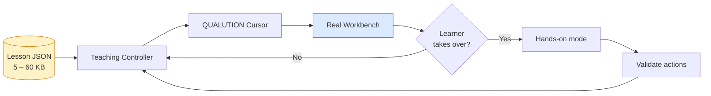

<details>
<summary><b>Illustrative lesson snippet</b> (simplified; the real schema may differ)</summary>

```json
{
  "id": "bell-state-noise",
  "title": "Entanglement on a noisy chip",
  "steps": [
    { "action": "say", "text": "Let's build a Bell state." },
    { "action": "placeGate", "gate": "H", "qubit": 0, "col": 0 },
    { "action": "placeGate", "gate": "CX", "control": 0, "target": 1, "col": 1 },
    { "action": "predict", "question": "Which outcomes will appear?", "options": ["00 only", "00 and 11", "all four"] },
    { "action": "run", "mode": "digitalTwin", "backend": "FakeManilaV2" },
    { "action": "highlight", "target": "fidelityScore" },
    { "action": "waitForLearner" }
  ]
}
```

</details>

| Benefit | Detail |
|---|---|
| **Lightweight** | 5 KB to 60 KB per lesson, so it works on low bandwidth |
| **Interactive** | Teaching actions manipulate the same circuit the learner uses |
| **Learner takeover** | Seamless switch from demonstration to hands-on |
| **Reusable** | New lessons need no Workbench redesign and no hard-coding |
| **Practical** | The lesson flows straight into building and running circuits |

---

## 🤖 Erwin: Socratic AI Companion

> **Erwin doesn't just say "wrong." It works out why.**

When a learner predicts an incorrect distribution, Erwin asks things like:

1. *What state did you expect?*
2. *Which gate changed the state?*
3. *What happens right before measurement?*
4. *Can you modify the circuit and test your hypothesis?*

And when a result looks "off" because of hardware, Erwin asks a fifth kind of question: *"Which of your gates run on the noisiest qubit pair?"*

### Verifiable AI pipeline

Generated explanations, code and optimisations are checked against the execution engine using deterministic checks and equivalence verification. **The AI never gets to present an unverified quantum result as fact.** Hardware claims are checked against the bundled calibration data in the same way.

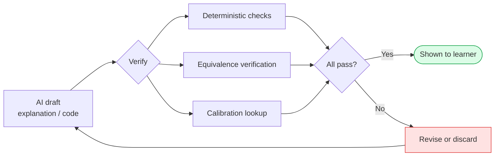

### Multi-signal learner model

Predictions, circuit behaviour and assessment results are combined to spot learning gaps and choose the next activity, so progress is **evidence-driven rather than time-driven**.

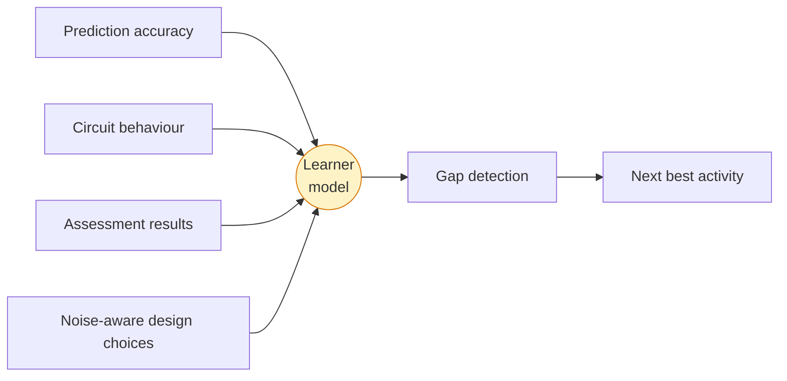

---

## 🏅 Assessment and Certification Flow

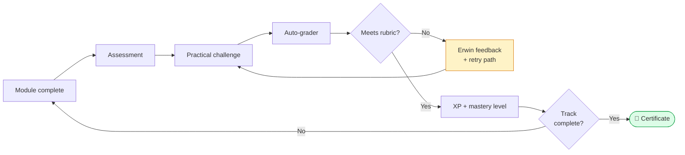

**The grader checks:** circuit construction, gate usage, measurement probabilities, required or forbidden operations, target outcomes and state fidelity.

---

## 📚 Curriculum

| Track | Modules |
|---|---|
| 🟦 **Foundations** | Bits and Qubits · Superposition and Hadamard · Multi-Qubit Systems and Entanglement · Measurement and Probability |
| 🟪 **Circuit Design and Algorithms** | Gate Library · Circuit Design and Complexity · Deutsch–Jozsa · Grover Search |
| 🟥 **Advanced and Variational** | Variational Circuits · QAOA · VQE · Adaptive Execution |
| 🧬 **Real Hardware Awareness** | Noise, T₁/T₂ and Decoherence · Hardware Topology and SWAP Cost · Noise-Aware Circuit Design |

Each module ends with an assessment and a practical challenge.

### Example: learning Grover's Search

Instead of *watch Grover, answer a quiz*, the learner goes through:

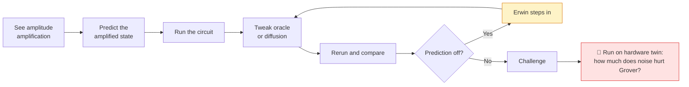

---

## 🌍 Impact

| Audience | Benefit |
|---|---|
| 🎓 **Students** | Hands-on guided learning that shortens the learning curve |
| 👩‍🏫 **Educators and academics** | Adaptive teaching with real experiments and less prep effort |
| 🧑‍💼 **Industry professionals** | Rapid, job-relevant upskilling on real or simulated backends, including noise-aware design |
| 🏛️ **Institutions** | One scalable environment for learning, experimentation and assessment |
| 🔭 **Quantum enthusiasts** | Accessible, visual, self-paced learning |

| Dimension | Outcome |
|---|---|
| **Educational** | Learning by visualisation and simulation; misconceptions addressed at the root; learners meet hardware reality early |
| **Economic** | Lower experimentation cost; faster workforce skill development |
| **Social** | Quantum access beyond physical QPU facilities, even offline; broader participation |
| **Environmental** | Less physical-lab dependence; simulation-first before QPU use |

---

## 🛡️ Feasibility and Risk Mitigation

| Challenge | Our mitigation |
|---|---|
| **Quantum execution scalability:** exponential resource growth | **Adaptive execution:** resource-aware routing and execution limits for larger circuits |
| **AI trust and quantum correctness:** AI may produce incorrect quantum behaviour | **Quantum verification:** deterministic checks and equivalence verification of AI-generated operations |
| **Hardware realism without hardware access:** real QPUs are scarce and queues are long | **Digital Twin:** bundled IBM calibration snapshots give realistic noise offline |
| **Stale or unavailable calibration data** | **Verified offline snapshots** in both backend and frontend, with no external dependency |
| **Adaptive learning accuracy:** is the learner truly understanding? | **Multi-signal learner model:** predictions, circuit behaviour and assessments combined |
| **Interactive teaching at scale:** avoid hard-coding every lesson | **JSON-driven lesson engine:** reusable structured lessons with the QUALUTION Cursor |
| **Browser performance for analytics** | **Rust → WebAssembly** fidelity engine with TypeScript fallback |

**Feasibility:** ✅ Technical (proven methods, mature tech) · ✅ Operational (modular, browser-based) · ✅ Market (growing quantum workforce need) · ✅ Economic (lightweight JSON, reusable lessons, local execution)

---

## 🗺️ Project Status and Roadmap

All core modules are implemented:

- [x] Concept, architecture and learning model
- [x] Quantum Workbench (drag-and-drop + code, bidirectional sync)
- [x] JSON-driven lesson engine and QUALUTION Cursor
- [x] Circuit Analyzer and multi-backend routing (Statevector, Stabilizer, MPS, cloud)
- [x] Erwin AI with Socratic guidance, misconception detection and verification
- [x] Student LMS, challenges and certification
- [x] Teacher visualisation and analytics
- [x] Collaborative learning
- [x] **Digital Twin:** dual concurrent ideal and noisy simulation
- [x] **Rust/WASM fidelity engine** with TypeScript fallback
- [x] **Hardware topology view and SWAP routing demonstration**
- [x] **Calibration-grounded AI tutor explanations**
- [x] **Offline-first twin** with bundled and frontend-verified snapshots

### Future directions

- 🔌 Additional cloud quantum hardware providers, enabling a path from simulation to more real QPUs
- 🧬 More hardware twins (additional IBM devices and other topologies) and error-mitigation lessons
- 🧠 Richer learner models and deeper misconception analysis
- 👥 Real-time collaborative circuit editing and instructor-led classroom sessions
- 📊 Population-level learning analytics for educators
- 🏆 Expanded competency-based certification

---

## 🚀 Getting Started

### Prerequisites

- Node.js `[version]` and npm
- Python `[version]` for the backend services
- Rust toolchain and `wasm-pack` *(only if you want to rebuild the WebAssembly fidelity module)*
- API keys as needed: AI provider (NVIDIA NIM, Groq) and cloud quantum provider
  *(the Digital Twin itself needs no keys and no network)*

### Installation

```bash
# 1. Clone the repository
git clone [YOUR_REPO_URL]
cd [YOUR_REPO_NAME]

# 2. Install frontend dependencies
npm install

# 3. Install backend dependencies (includes qiskit-aer and qiskit-ibm-runtime)
pip install -r requirements.txt

# 4. (Optional) Rebuild the Rust → WASM fidelity module
[wasm build command, e.g. wasm-pack build --target web]

# 5. Configure environment
cp .env.example .env
# then fill in the required values

# 6. Start the backend and the frontend
[backend start command]
npm run dev
```

Open the local URL printed by the dev server in your browser.

### Try the Digital Twin

1. Open the **Workbench** and build a Bell state (`H` on Q0, then `CX` Q0 → Q1).
2. Switch the run mode to **Digital Twin** and choose `FakeManilaV2`.
3. Compare the ideal and noisy distributions and read the **fidelity score**.
4. Move the `CX` to Q0 → Q2, rerun, and watch SWAPs appear and fidelity drop.
5. Ask **Erwin** why, and get a diagnosis based on the calibration data.

---

## 🧰 Tech Stack

| Layer | Technology |
|---|---|
| **Frontend** | React 19, TypeScript, Vite |
| **Animation and UI motion** | Anime.js |
| **Local execution** | WebAssembly, Web Workers |
| **Fidelity engine** | Rust compiled to WebAssembly, with pure TypeScript fallback |
| **Offline and persistence** | PWA, IndexedDB via Dexie.js |
| **Quantum simulation** | Statevector, Stabilizer, MPS, cloud backend, OpenQASM, Qiskit, Qiskit Aer |
| **Digital Twin** | Qiskit Aer noise models, `qiskit_ibm_runtime.fake_provider` (`FakeManilaV2`, `FakeJakartaV2`) |
| **AI and learning** | Erwin (Socratic tutor), misconception engine, NVIDIA NIM, Groq, on-device SmolLM-135M |
| **Backend** | Python, FastAPI |
| **Testing** | Vitest, Pytest |

---


---


---

<div align="center">

**Learn the concept. Build the circuit. Predict the result. Execute the computation. Analyze the evidence. Meet the noise. Prove mastery.**

Made with ⚛️ by **Team DADBODS** for **Smart India Hackathon**

</div>
