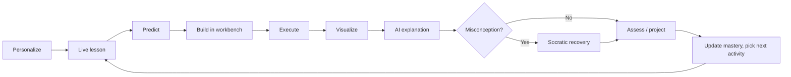
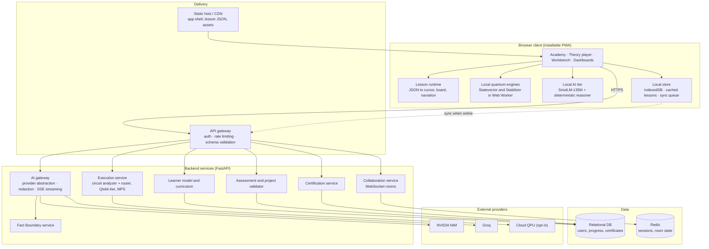
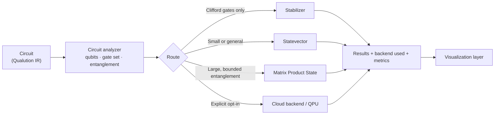
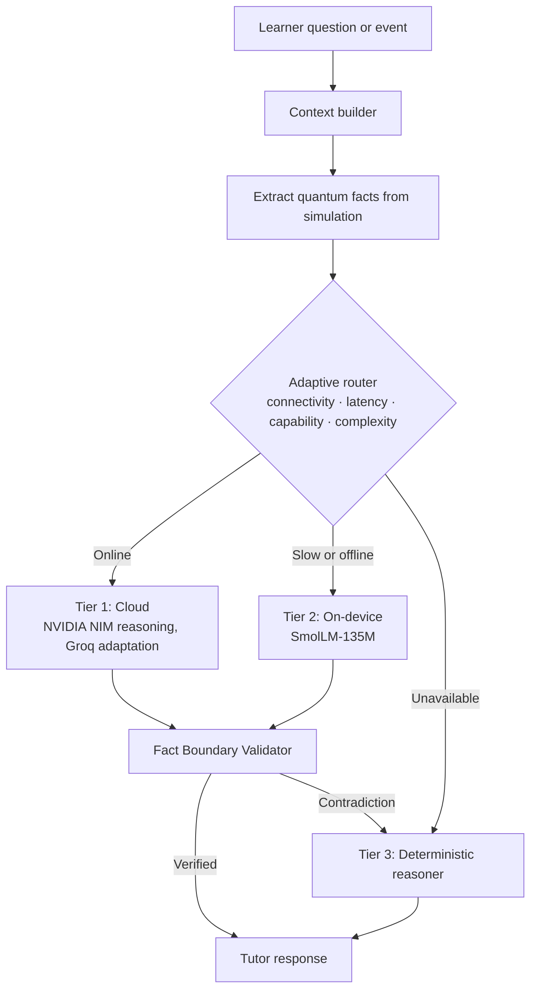
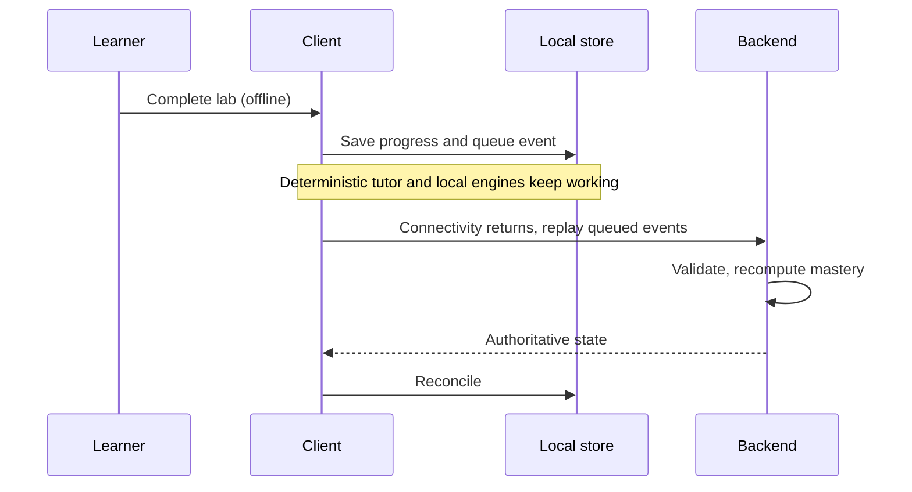

# ⚛️ Qualution

**A live-taught, offline-first quantum learning platform with a built-in quantum workbench.**

*Watch it taught. Predict. Build. Run. See the state. Understand why.*

| | |
|---|---|
| **Event** | Smart India Hackathon 2026 |
| **Team** | DADBODS |
| **Problem Statement** | SIH26140: AI-Based Interactive Quantum Algorithm Learning Platform |
| **Theme / Category** | Smart Education / Software |
| **Demo** | `[demo video URL]` · `[live app URL]` |


<!-- Replace with a real screenshot or GIF: workbench with circuit, Q-Sphere and tutor panel visible. -->

---

## The Problem

Learners of quantum computing must connect five separate worlds: mathematics, circuit diagrams, code, simulation, and interpretation of measurement results. Today each lives in a different tool. Video courses are heavy for low-bandwidth users, generic AI chatbots can describe the wrong quantum state with full confidence, and hands-on practice usually needs setup or hardware access that most students in India do not have.

`[Add 1 or 2 cited statistics on the quantum skills gap, e.g. from the IEEE QCE sources in the SIH deck.]`

## The Solution

Qualution puts the complete learning loop in one browser workspace:

1. A **teaching engine** replays a lesson from lightweight structured data: a teacher cursor writes, draws, highlights, narrates, and pauses.
2. The lesson hands off into a **quantum workbench** where the learner predicts, builds, and runs the circuit.
3. **Deterministic simulators** produce the ground truth; **synchronized visualizations** show it.
4. An **AI tutor** explains the result, and every claim is checked against simulation facts before the learner sees it.
5. **Misconception-aware adaptation** chooses what the learner does next.

> **Core principle:** quantum truth comes from computation. AI explains results; it never establishes them.

## What Makes It Different

| Conventional quantum learning | Qualution |
|---|---|
| Recorded video or static slides | Lessons replayed from structured JSON (small files, reusable, editable) |
| Theory and coding in separate tools | Theory hands off directly into the workbench |
| Generic chatbot that can hallucinate | Circuit-grounded tutor with fact validation and deterministic fallback |
| One simulator for everything | Circuit analyzer routes to Statevector, Stabilizer, or MPS |
| Right/wrong grading | Misconception-aware feedback and Socratic prediction checks |
| Online-only | Cloud → on-device model → deterministic engine |
| Fixed syllabus | Evidence-driven next-activity recommendation |

## Signature Feature: JSON-Driven Live Teaching

A lesson is data, not code. The same teaching engine plays every lesson, and lesson files are validated against a schema. Lesson scripts never execute arbitrary code.

```json
{
  "schemaVersion": "1.0",
  "id": "qubit-superposition-01",
  "title": "What is a qubit?",
  "objectives": ["Explain superposition", "Apply H to |0⟩"],
  "steps": [
    { "action": "write",   "text": "What is a qubit?", "style": "heading" },
    { "action": "math",    "latex": "H|0\\rangle = \\tfrac{1}{\\sqrt{2}}(|0\\rangle + |1\\rangle)" },
    { "action": "highlight", "target": "basis-states" },
    { "action": "narrate", "text": "A qubit can be in a superposition of 0 and 1.", "lang": "en" },
    { "action": "pause",   "prompt": "Predict the measurement result." },
    { "action": "openWorkbench", "task": "predict-then-run", "circuit": ["H", "measure"] }
  ]
}
```
<!-- Illustrative example. Replace with a trimmed real lesson from /lessons. -->

Typical lesson files are `[5–60 KB]`, compared with `[X MB]` for an equivalent video, so lessons load quickly on weak connections and can be cached for offline use.

## Feature Status

| Capability | Status |
|---|---|
| Quantum IDE with visual ↔ code sync (Qiskit, OpenQASM, PennyLane) | ✅ Implemented |
| Statevector, Stabilizer, MPS engines with automatic routing | ✅ Implemented |
| Q-Sphere, Bloch spheres, histogram, statevector inspector, circuit metrics | ✅ Implemented |
| Three-tier AI (cloud, on-device SLM, deterministic) with Fact Boundary validation | ✅ Implemented |
| Prediction loop, adaptive curriculum, capstone projects with deterministic validation | ✅ Implemented |
| JSON-driven live teaching engine | 🔧 In progress |
| Misconception detection and Socratic Grover module | 🔧 In progress |
| Student and teacher dashboards | 🔧 In progress |
| Collaborative sessions | 🔧 In progress |
| Course certification | 📅 Planned |
| Cloud QPU execution (opt-in) | 📅 Planned |

<!-- Confirm every row against the actual codebase before submission. -->

## The Learning Loop



## System Architecture

Qualution keeps **content, rendering, simulation, AI, and assessment as independent modules**. A new lesson does not require a new renderer, a new AI provider does not touch the workbench, and a new simulator does not touch the learning system.



### Key design decisions

| Decision | Why | Trade-off |
|---|---|---|
| Lessons as validated JSON | Small, reusable, safe, authorable without engineering | Needs a well-versioned schema and a lesson authoring workflow |
| Run small circuits in the browser | Zero latency and works offline | Browser memory limits; large circuits go to the backend |
| Route by circuit structure | Right engine per circuit; MPS and Stabilizer scale far beyond statevector | Router must be conservative to stay correct |
| Provider keys only on backend | No credential exposure | AI gateway is a required hop when online |
| Validate AI output against simulation facts | Prevents confidently wrong explanations | Coverage limited to supported claim types (see below) |
| Local-first storage with sync queue | Learning continues offline | Requires conflict rules (server is authoritative for certificates and scores) |

### Execution routing



Probabilities and statevectors are deterministic. Sampled shot counts use a seeded random generator so a run can be reproduced. `[Confirm: which engines run in the browser and which run on the backend.]`

### Grounded AI request flow



**What the validator checks:** basis probabilities, Bell-state identity, gate semantics, qubit count, circuit properties, and simulator routing. Claims outside these categories are shown as unverified rather than silently trusted. `[Add evaluation result: e.g. contradictions caught on N adversarial test explanations.]`

### Offline-first and sync



## Learning Features

- **Live theory lessons** with teacher cursor, math rendering (KaTeX), narration, and intentional pauses
- **Socratic Grover module:** predict oracle and amplification behavior, run, compare, reflect
- **Misconception detection:** maps the gap between prediction and simulated result to a likely misconception, then gives a targeted explanation and re-test
- **Practical labs and capstone projects** (Bell states, superposition, teleportation, Grover's search, debugging, optimization) with **deterministic validation**, not LLM grading
- **Adaptive curriculum:** predictions, labs, projects, and misconceptions feed a learner model that recommends remediation or advancement
- **Dashboards:** students see progress, mastery by concept, XP, and next recommended activity; teachers see class mastery, completion, and common misconceptions
- **Collaborative sessions:** shared circuits and activities, with individual progress kept separate
- **Certification:** issued after theory, labs, assessments, and required projects are complete, with `[a verification ID / QR]`

## Quantum Workbench

**Operations:** H, X, Y, Z, S, T, CX, CZ, SWAP, CCX, RX, RY, RZ, measurement, barriers, controlled gates.

**Visualization:** Q-Sphere, Bloch spheres, theoretical vs sampled histograms, statevector inspector (amplitudes, phase, probability).

**Metrics:** gate count, depth, entangling-gate count, backend used, memory estimate, latency.

## Benchmarks

**Environment:** `[CPU, RAM, OS, runtime, library versions]` · **Method:** `[median of N runs after warm-up]`

### MPS engine (nearest-neighbor bounded entanglement, 1,000 shots)

| Qubits | Time | Truncation error | Fidelity | Memory |
|---:|---:|---:|---:|---|
| 25 | 16.73 ms | 0.000000 | 1.000000 | < 1 MB |
| 30 | 29.85 ms | 0.000000 | 1.000000 | < 1 MB |
| 50 | 26.13 ms | 0.000000 | 1.000000 | < 1 MB |
| 100 | 39.87 ms | 0.000000 | 1.000000 | < 1 MB |
| 200 | 89.11 ms | 0.000000 | 1.000000 | < 2 MB |
| 500 | 94.63 ms | 0.000000 | 1.000000 | < 3 MB |
| 1,000 | 219.16 ms | 0.000000 | 1.000000 | < 5 MB |
| 2,000 | 574.72 ms | 0.000000 | 1.000000 | < 10 MB |

Bond dimension: `[χ]`.

### Stabilizer engine (tableau)

| Qubits | Single shot | 100 shots | Tableau memory |
|---:|---:|---:|---:|
| 10 | 0.14 ms | 2.68 ms | 441 B |
| 50 | 0.59 ms | 28.64 ms | 9.96 KB |
| 100 | 3.49 ms | 193.81 ms | 39.45 KB |
| 500 | 214.31 ms | 24.54 s | 978.52 KB |
| 1,000 | 1.91 s | 190.87 s | 3.82 MB |

### Limits

- MPS is efficient only for bounded entanglement; highly entangled circuits need large bond dimensions and are routed elsewhere.
- Statevector memory grows as 2ⁿ; the IDE shows the requirement before running.
- Stabilizer simulation covers Clifford circuits only.

## Security and Privacy

- Provider credentials exist only on the backend; none in `VITE_*` variables.
- Secrets, authorization headers, and provider error details are redacted from AI logs and responses.
- Lesson scripts are schema-validated data; no `eval` or `exec`.
- Only circuit operations from an allow-list are accepted by the execution service.
- Learner data is minimal and stored per user; `[state how it aligns with the Digital Personal Data Protection Act, 2023, and how teachers access class data]`.

## Tech Stack

| Layer | Technologies |
|---|---|
| Frontend | React 19, TypeScript, Vite, Vitest, KaTeX, Web Workers, WebGPU/WASM, IndexedDB (Dexie) |
| Backend | Python, FastAPI, Pydantic, Pytest, SSE streaming |
| Quantum | Qiskit, Qiskit Aer, OpenQASM, PennyLane interoperability, Qualution IR |
| AI | NVIDIA NIM (Nemotron), Groq, SmolLM-135M-Instruct (Transformers.js / ONNX Runtime Web) |
| Content | Structured JSON lessons, Remotion, Blender |

## Getting Started

```bash
git clone [repository-url]
cd qualution

# Backend
cd backend
pip install -r requirements.txt
cp .env.example .env          # add provider keys (optional; app falls back without them)
[backend start command]

# Frontend (new terminal)
cd frontend
npm install
[frontend start command]
```

| Scope | Variable | Purpose |
|---|---|---|
| Backend | `[NVIDIA key variable]` | NVIDIA NIM access |
| Backend | `[Groq key variable]` | Groq access |
| Frontend | `[API base URL variable]` | Backend URL |

Never commit real keys.

## Testing

```bash
[backend test command]
[frontend test command]
```

| Suite | Result |
|---|---|
| Backend AI regression | `[x / y]` |
| Frontend AI integration | `[x / y]` |

Frontend tests that require WebGL/canvas are excluded because jsdom does not support them.

## Repository Structure

```
qualution/
├── frontend/     # Academy, theory player, workbench, dashboards
├── backend/      # API, execution router, AI gateway, validators, tests
├── lessons/      # JSON lesson scripts and schema
├── docs/         # Architecture, AI, API documentation
└── README.md
```
<!-- Replace with the real tree from the final repository. -->

## Roadmap

| Now | Next | Later |
|---|---|---|
| Finish live teaching engine | Misconception library expansion | Cloud QPU execution |
| Dashboards | Collaborative sessions at scale | Regional-language narration |
| Integration and regression testing | Certification with verification | Lesson authoring tool for educators |

## Target Users and Impact

**Users:** students, educators and academics, institutions, industry professionals upskilling, and quantum enthusiasts.

**Impact:** lowers the barrier to quantum computing, removes the need for physical QPU access during learning, reduces content bandwidth, gives educators evidence of where learners struggle, and supports workforce development in Smart Education.

## Team DADBODS

| Name | Role |
|---|---|
| `[Name]` | `[Role]` |

Institution: `[College]` · Mentor: `[Name]`

## License

`[License]`. See [LICENSE](LICENSE).

---

**Qualution: a learner enters, is taught a concept visually, predicts, builds, runs, sees the state, gets grounded feedback, and earns mastery without leaving the environment.**
