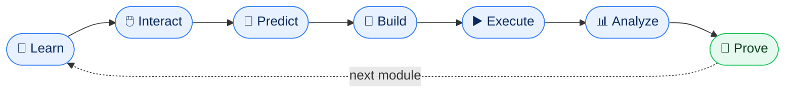
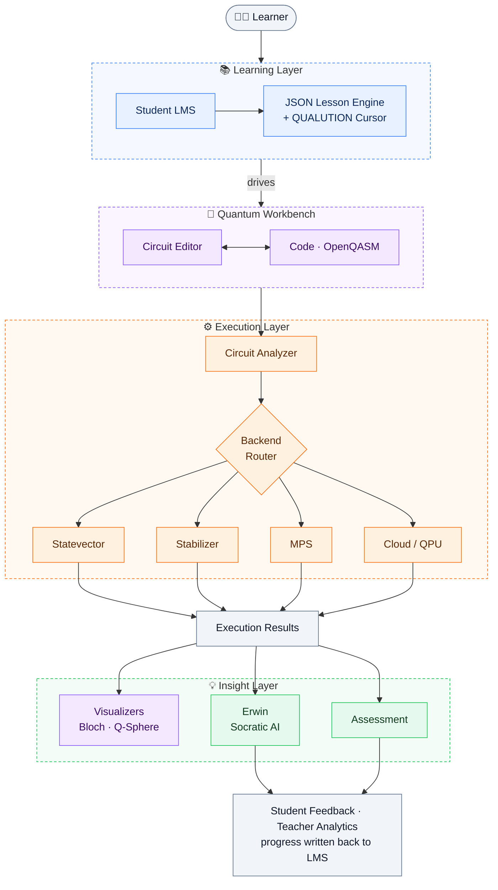
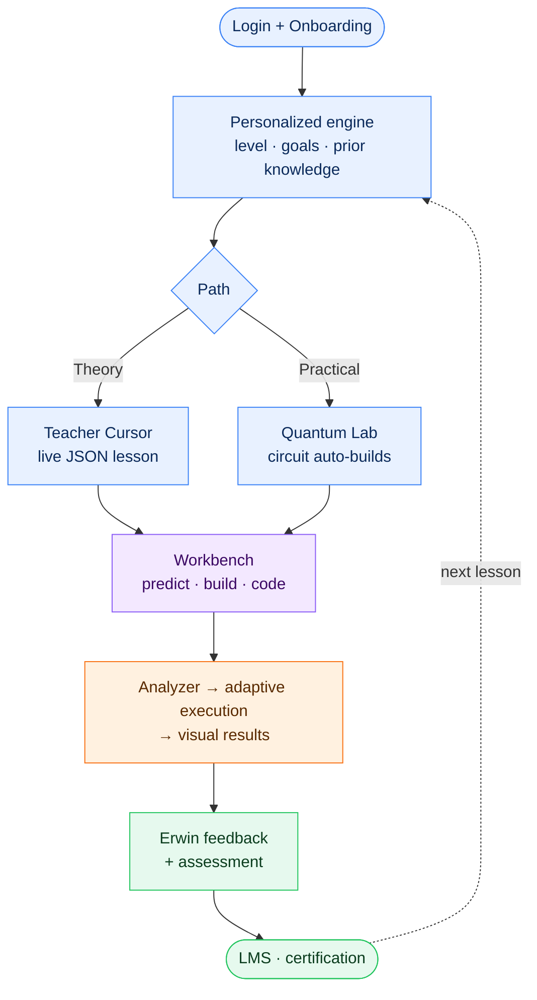
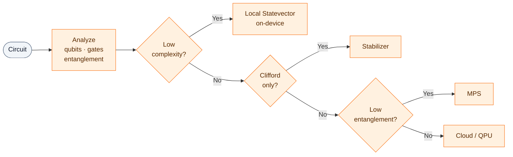
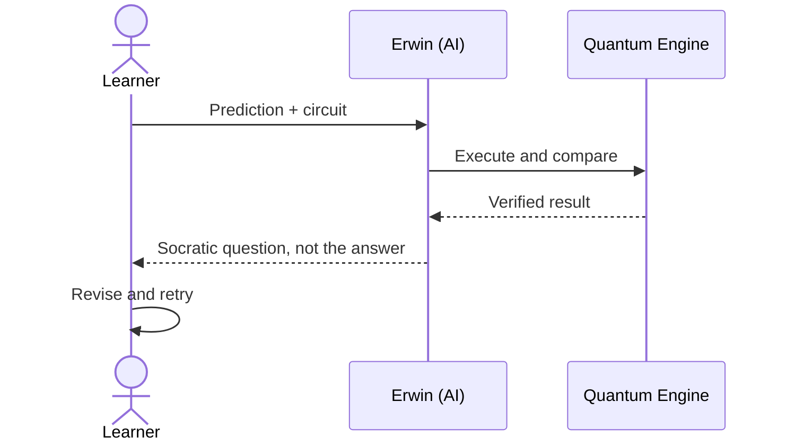

<div align="center">


<br/>

**An interactive, AI-assisted quantum learning and simulation platform where the lesson happens *inside* the workbench.**

*Learn. Build. Predict. Execute. Prove.*


[🎬 Demo](#-links) · [📝 Article](#-links) · [🏗️ Architecture](#%EF%B8%8F-architecture) · [🚀 Getting Started](#-getting-started) · [👥 Team](#-team)

</div>

---

## 📌 SIH Problem Statement

| | |
|---|---|
| **Problem Statement ID** | 26140 |
| **Title** | AI-Based Interactive Quantum Algorithm Learning Platform |
| **Theme** | Smart Education |
| **Category** | Software |
| **Team Name** | DADBODS |
| **Team ID** | 126917 |

---

## 📖 Table of Contents

- [Overview](#-overview)
- [The Problem](#-the-problem)
- [Our Solution](#-our-solution)
- [The QUALUTION Learning Loop](#-the-qualution-learning-loop)
- [Key Features](#-key-features)
- [How We Are Different](#-how-we-are-different)
- [Architecture](#%EF%B8%8F-architecture)
- [Adaptive Circuit Execution](#-adaptive-circuit-execution)
- [JSON-Driven Live Teaching](#-json-driven-live-teaching)
- [Erwin: Socratic AI Companion](#-erwin-socratic-ai-companion)
- [Curriculum](#-curriculum)
- [Impact](#-impact)
- [Feasibility & Risk Mitigation](#-feasibility--risk-mitigation)
- [Project Status & Roadmap](#-project-status--roadmap)
- [Getting Started](#-getting-started)
- [Tech Stack](#-tech-stack)
- [Team](#-team)
- [Links](#-links)
- [References](#-references)
- [License](#-license)

---

## 🌌 Overview

Quantum computing is becoming an important computational paradigm, but it is hard to learn. Students face abstract mathematics, unfamiliar computational ideas, circuit-based reasoning, and specialised software, usually spread across separate lecture notes, simulators, and coding tools.

**QUALUTION** unifies all of it. It combines structured lessons, live teaching, a professional **Quantum Workbench**, multi-backend simulation, an AI tutor, assessments, a student and teacher LMS, and certification into one continuous environment.

> **The AI explains. The quantum engine verifies.**

---

## ❗ The Problem

| # | Challenge | What it looks like today |
|---|---|---|
| 1 | **High-complexity concepts** | Superposition, entanglement and interference are hard to grasp without seeing circuit behaviour. |
| 2 | **Theory and practice are separated** | Notes in one place, a simulator in another. Concept → circuit → execution → understanding is broken across tools. |
| 3 | **Static learning** | Videos and PDFs offer no continuous interaction, experimentation, or feedback. |
| 4 | **Limited hardware access** | Real QPUs are scarce, and local simulation gets exponentially expensive as qubits grow. |
| 5 | **Shallow feedback** | Automated grading says *wrong*, but not *which misconception caused it*. |
| 6 | **Fragmented management** | Students lack learning paths and proof of mastery, and teachers lack visibility into progress. |

---

## 💡 Our Solution

QUALUTION answers each gap directly.

- 🎓 **Interactive, visual learning** that makes quantum behaviour observable.
- 🧪 **All-in-one Quantum Workbench** where theory, coding, simulation and assessment live together.
- 🔀 **Circuit-intelligent execution** that picks the right simulation strategy for each circuit.
- 🤖 **Misconception-aware AI (Erwin)** that diagnoses the root cause of an error through Socratic guidance.
- 📊 **Evidence-driven curriculum** that uses demonstrated reasoning to choose the learner's next activity.
- 🏫 **Student LMS, teacher analytics, and certification** that close the loop from learning to proof of mastery.

---

## 🔁 The QUALUTION Learning Loop



| Stage | What the learner does |
|---|---|
| **Learn** | Receives a structured explanation of a concept |
| **Interact** | Engages with visual teaching content instead of passive media |
| **Predict** | Commits to an expected outcome before running anything |
| **Build** | Constructs the circuit in the Workbench |
| **Execute** | Runs it on an appropriate backend |
| **Analyze** | Inspects states, probabilities and measurement results |
| **Prove** | Completes a practical challenge or assessment |

---

## ✨ Key Features

### 🧪 Quantum Workbench
Drag-and-drop circuit construction, gate placement and editing, a code editor, and OpenQASM-based workflows. **Circuit and code stay in sync in both directions**, so learners never have to choose between visual and programmatic thinking.

### 🎬 JSON-Driven Live Teaching (QUALUTION Cursor)
Lessons are lightweight structured data that *drive the real Workbench*. A teacher cursor places gates, highlights components, runs circuits and asks prediction questions. The learner can take over at any moment.

### 🧠 Intelligent Circuit Analyzer
Inspects qubit count, gate composition, entanglement and complexity, then routes the circuit to the best backend automatically.

### 🤖 Erwin, the AI Learning Companion
Detects misconceptions and guides with Socratic questions instead of handing over answers.

### ✅ Verifiable AI
AI predictions are executed and compared against simulator results, so unsupported quantum claims are caught.

### 📈 Visualisation
Circuit diagrams, probability distributions, **Bloch sphere** and **Q-sphere** views.

### 🎮 Gamified Learning Path
Structured modules, practical challenges, XP and mastery progression.

### 🏫 Student LMS and Teacher Visualisation
Track lessons, challenges, scores and prediction performance. Teachers see progress and where learners struggle.

### 🤝 Collaborative Learning
Shared circuit challenges and a shared learning workflow.

### 🏅 Assessment and Certification
Practical grading of circuit construction, gate usage, measurement probabilities, required or forbidden operations, target outcomes and state fidelity, leading to certification.

### 📴 Local-First and Low-Bandwidth
Lessons ship as **5 KB to 60 KB JSON**. Browser execution, WebAssembly, Web Workers, IndexedDB (Dexie.js) and PWA capabilities keep selected workloads running offline. The principle is **local when possible, cloud when necessary.**

---

## 🆚 How We Are Different

> **Teaching happens inside the Workbench.** Structured lessons directly control live teaching, visualisation and experimentation in the same production environment.

| Capability | Conventional fragmented workflow | **QUALUTION** |
|---|---|---|
| Theory | Separate learning resources | Integrated interactive lessons |
| Practical work | Separate simulator and coding tools | Unified Quantum Workbench |
| Teaching | Passive videos and documents | Structured live teaching inside the Workbench |
| Visualisation | Separate tools | Integrated Bloch and Q-sphere views |
| AI assistance | Generic chatbot | Erwin with Socratic, misconception-aware guidance |
| Execution | Single or limited backend | Capability-based multi-backend routing |
| Assessment | Separate quizzes testing recall | Practical circuit challenges |
| Student management | Separate LMS | Integrated Student LMS |
| Teacher monitoring | Limited | Teacher visualisation and analytics |
| Certification | Separate process | Connected mastery pathway |

---

## 🏗️ Architecture



**Design principle:** education, AI, circuit analysis, and quantum execution are separate layers that communicate through defined interfaces. Each can evolve independently.

### User Flow



---

## 🔀 Adaptive Circuit Execution

A dense statevector needs memory that grows **exponentially** with qubit count, so no single simulator suits every circuit. QUALUTION treats simulation as a **backend selection problem** and routes by circuit characteristics.

| Backend | Best for | Why |
|---|---|---|
| **Local Statevector** (on-device / browser) | Small, general, low-complexity circuits | Full state detail, no network needed |
| **Stabilizer** (Gottesman–Knill) | Clifford / stabilizer circuits | Polynomial scaling for this circuit class |
| **MPS** (Matrix Product State) | Larger circuits with limited entanglement | Far less memory than a dense statevector |
| **Cloud / QPU** | Large or specialised workloads | Access beyond local limits, including real hardware |



The analyzer weighs **qubit count, gate type, entanglement, and complexity**, then explains its choice to the learner. Understanding *both* the algorithm and the resources needed to run it is a professional skill worth teaching.

---

## 🎬 JSON-Driven Live Teaching

Instead of shipping a video, a lesson is **data** that a Teaching Controller plays inside the real Workbench.

```text
Lesson JSON → Teaching Controller → Workbench Action → Learner Interaction → Validation
```

**A lesson can:** move the cursor to a circuit element · highlight a component · place a gate · execute a circuit · display math · ask a prediction question · wait for learner input · validate the learner's actions.

<details>
<summary><b>Illustrative lesson snippet</b> (simplified; the real schema may differ)</summary>

```json
{
  "lesson": "superposition-and-hadamard",
  "steps": [
    { "action": "narrate",   "text": "A Hadamard gate creates an equal superposition." },
    { "action": "placeGate", "gate": "H", "qubit": 0, "moment": 0 },
    { "action": "predict",   "question": "What are the measurement probabilities?" },
    { "action": "execute" },
    { "action": "validate",  "expect": { "00": 0.5, "10": 0.5 } }
  ]
}
```

</details>

| Benefit | Detail |
|---|---|
| **Lightweight** | 5 KB to 60 KB per lesson, so it works on low bandwidth |
| **Interactive** | Teaching actions manipulate the same circuit the learner uses |
| **Learner takeover** | Seamless switch from demonstration to hands-on |
| **Reusable** | New lessons need no Workbench redesign and no hard-coding |
| **Practical** | The lesson flows straight into building and running circuits |

---

## 🤖 Erwin: Socratic AI Companion

Erwin doesn't just say "wrong." It works out **why**.

```text
Wrong Answer → Underlying Conceptual Error → Targeted Explanation → New Attempt
```

When a learner predicts an incorrect distribution, Erwin asks things like:

- *What state did you expect?*
- *Which gate changed the state?*
- *What happens right before measurement?*
- *Can you modify the circuit and test your hypothesis?*

### Verifiable AI pipeline



Generated explanations, code and optimisations are **checked against the execution engine** using deterministic checks and equivalence verification. The AI never gets to present an unverified quantum result as fact.

### Multi-signal learner model
Predictions, circuit behaviour and assessment results are combined to spot learning gaps and choose the **next** activity, so progress is evidence-driven rather than time-driven.

---

## 📚 Curriculum

| Track | Modules |
|---|---|
| **Foundations** | Bits and Qubits · Superposition and Hadamard · Multi-Qubit Systems and Entanglement · Measurement and Probability |
| **Circuit Design and Algorithms** | Gate Library · Circuit Design and Complexity · Deutsch–Jozsa · Grover Search |
| **Advanced and Variational** | Variational Circuits · QAOA · VQE · Adaptive Execution |

Each module ends with an **assessment and a practical challenge**.

### Example: Learning Grover's Search

Instead of **Watch Grover → Answer Quiz**, the learner goes through
**Understand → Predict → Build → Execute → Observe → Modify → Explain → Prove**.
They see amplitude amplification, predict which state gets amplified, run the circuit, tweak the oracle or diffusion operator, and rerun. Erwin steps in if the prediction was off, and a challenge closes it out.

---

## 🌍 Impact

| Audience | Benefit |
|---|---|
| 🎓 **Students** | Hands-on guided learning that shortens the learning curve |
| 👩‍🏫 **Educators and academics** | Adaptive teaching with real experiments and less prep effort |
| 🧑‍💼 **Industry professionals** | Rapid, job-relevant upskilling on real or simulated backends |
| 🏛️ **Institutions** | One scalable environment for learning, experimentation and assessment |
| 🔭 **Quantum enthusiasts** | Accessible, visual, self-paced learning |

| Dimension | Outcome |
|---|---|
| **Educational** | Learning by visualisation and simulation; misconceptions addressed at the root |
| **Economic** | Lower experimentation cost; faster workforce skill development |
| **Social** | Quantum access beyond physical QPU facilities; broader participation |
| **Environmental** | Less physical-lab dependence; simulation-first before QPU use |

<details>
<summary><b>Commercial and go-to-market strategy</b></summary>

| Pillar | B2G / B2B (Institutional) | B2C (Community) |
|---|---|---|
| **Target users** | MoE, AICTE, NQM Labs, universities | Students, learners, STEM enthusiasts |
| **Value** | No hardware lab, teacher LMS, analytics | Interactive Workbench, Erwin AI, simulation |
| **Revenue** | Institutional licensing, NQM programs | Freemium, Pro certification, QPU credits |
| **Cost** | Local execution, lower cloud cost | PWA, serverless, pay-as-you-go cloud |
| **Go-to-market** | GeM, university partnerships | Web / PWA, hackathons, communities |

</details>

---

## 🛡️ Feasibility & Risk Mitigation

| Challenge | Our mitigation |
|---|---|
| **Quantum execution scalability**: exponential resource growth | **Adaptive execution**: resource-aware routing and execution limits for larger circuits |
| **AI trust and quantum correctness**: AI may produce incorrect quantum behaviour | **Quantum verification**: deterministic checks and equivalence verification of AI-generated operations |
| **Adaptive learning accuracy**: is the learner truly understanding? | **Multi-signal learner model**: predictions, circuit behaviour and assessments combined |
| **Interactive teaching at scale**: avoid hard-coding every lesson | **JSON-driven lesson engine**: reusable structured lessons with the QUALUTION Cursor |

**Feasibility:** ✅ Technical (proven methods, mature tech) · ✅ Operational (modular, browser-based) · ✅ Market (growing quantum workforce need) · ✅ Economic (lightweight JSON, reusable lessons, local execution)

---

## 🚧 Project Status & Roadmap

> **Prototype is 40%+ complete.** See the demo and repository links below for the current state.

<!-- Update the checkboxes below to match what is actually built before submission. -->

- [x] Concept, architecture and learning model
- [ ] Quantum Workbench (drag-and-drop + code, bidirectional sync)
- [ ] JSON-driven lesson engine and QUALUTION Cursor
- [ ] Circuit Analyzer and multi-backend routing
- [ ] Erwin AI with Socratic guidance and verification
- [ ] Student LMS, challenges and certification
- [ ] Teacher visualisation and analytics

**Future directions**

- 🔌 Additional cloud quantum hardware providers, enabling a path from simulation to real QPUs
- 🧠 Richer learner models and deeper misconception analysis
- 👥 Real-time collaborative circuit editing and instructor-led classroom sessions
- 📊 Population-level learning analytics for educators
- 🏆 Expanded competency-based certification

---

## 🚀 Getting Started

> ⚠️ **Fill in the exact commands for your stack.** The scaffold below is ready to edit.

### Prerequisites

- Node.js `[version]` and npm
- Python `[version]` (if a backend is used)
- `[Any API keys: AI provider, cloud quantum provider, database]`

### Installation

```bash
# 1. Clone the repository
git clone [YOUR_REPO_URL]
cd [YOUR_REPO_NAME]

# 2. Install dependencies
npm install

# 3. Configure environment
cp .env.example .env
# then fill in the required values

# 4. Run the development server
npm run dev
```

Open **http://localhost:3000** in your browser.

### Environment variables

| Variable | Purpose |
|---|---|
| `[VAR_NAME]` | `[what it is for]` |

---

## 🧰 Tech Stack

> Confirm and edit this to match your actual implementation.

| Layer | Technology |
|---|---|
| **Frontend** | `[e.g. React / Next.js, TypeScript]` |
| **Workbench and visualisation** | `[e.g. canvas library, Three.js for Bloch / Q-sphere]` |
| **Local execution** | WebAssembly, Web Workers |
| **Offline and persistence** | PWA, IndexedDB via [Dexie.js](https://dexie.org) |
| **Animation and UI motion** | [Anime.js](https://animejs.com) |
| **Quantum simulation** | Statevector, Stabilizer, MPS, cloud backend, OpenQASM |
| **AI and learning** | Erwin (Socratic tutor), misconception engine, `[LLM provider]` |
| **Backend and database** | `[e.g. FastAPI, Supabase / PostgreSQL]` |
| **Deployment** | `[e.g. Vercel, Docker]` |

---


## 📚 References

- IEEE research on the abstraction gap in quantum learning and the need to connect theory with executable programs. `[add links]`
- IEEE workforce-development research identifying education as key to the emerging quantum workforce. `[add links]`
- IEEE Quantum Week (QCE) papers on university, industry and research efforts to build the quantum workforce. `[add links]`


---

<div align="center">

**Learn the concept. Build the circuit. Predict the result. Execute the computation. Analyze the evidence. Collaborate with others. Prove mastery.**

Made with ⚛️ by **Team DADBODS** for **Smart India Hackathon 2026**

</div>
